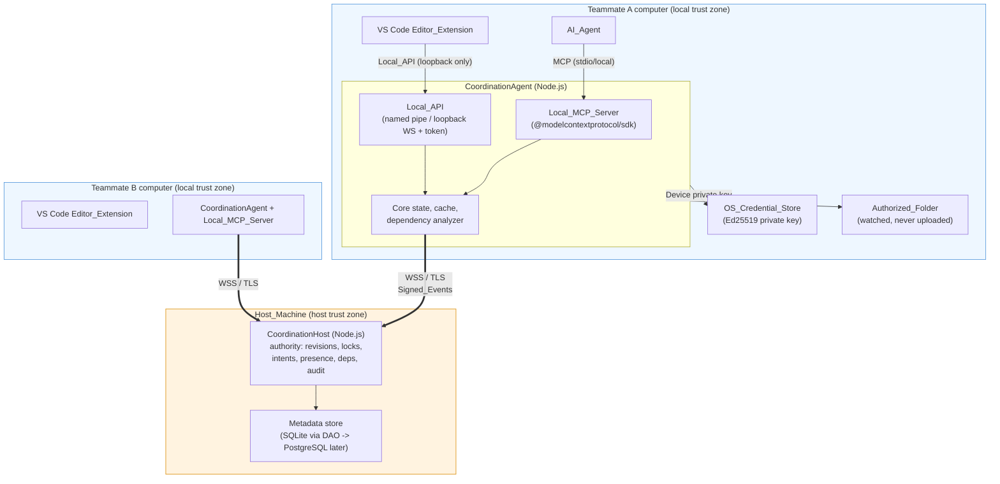
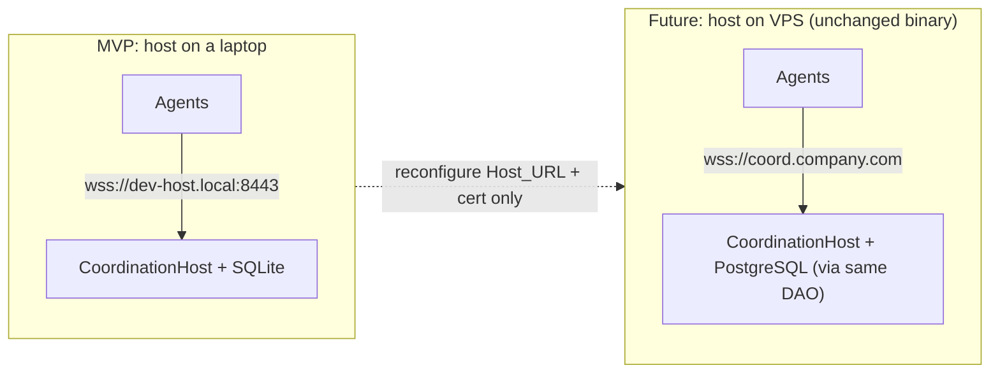
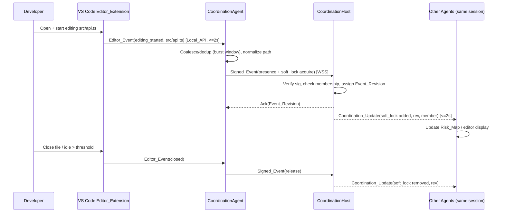
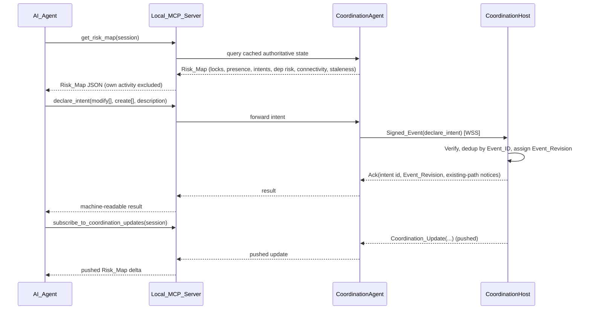
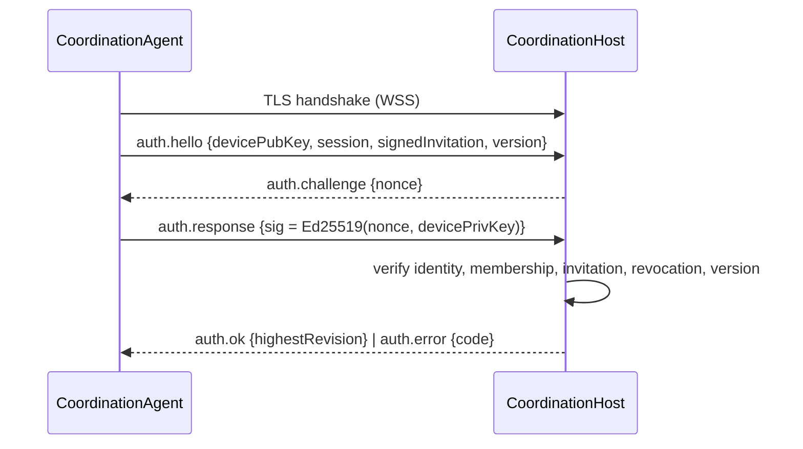

# Design Document: Collaborative File Lock Sync (Host-Based MVP)

## Overview

### Problem

Multiple developers — and, increasingly, multiple AI coding agents acting on their behalf — edit the same shared repository concurrently. Today they discover collisions only after they overwrite each other's work or break a caller through an indirect dependency. There is no machine-readable, real-time signal an AI agent can query before it edits or creates a file to answer three questions:

1. Which files is someone changing **right now**? (active Soft_Locks + Presence_Events)
2. Which files **will or might** change? (Declared_Intents + Planned_File_Creations)
3. Which files are **indirectly at risk** because they depend on files being changed elsewhere? (dependency-aware coordination)

Together these form a **Risk_Map** that an AI_Agent can act on programmatically.

### MVP Goal

Deliver the full coordination value on a **host-based client/server model**, implemented entirely in **TypeScript/Node.js**:

- A single **CoordinationHost** (definitive authority) reachable over a configurable secure `Host_URL` (WSS/TLS).
- A per-user **CoordinationAgent** on each teammate's computer holding one outbound persistent connection, exposing a **localhost-only Local_API**, and embedding a **Local_MCP_Server**.
- A **VS Code Editor_Extension** that talks only to its local agent.
- **Per-device Ed25519 identity**, `Signed_Invitation` admission, revocation, and key rotation.
- **Three Risk_Levels** (soft / coordination-required / hard) driven by a `Repository_Rules_Config`.
- **Metadata-only** dependency-aware coordination.
- **Monotonic Event_Revision** ordering, reconnect-safe sync, heartbeats/expiry, audit, offline safety.

The host runs first on a developer's laptop and later moves **unchanged** to a VPS or company server — only the configured `Host_URL` changes.

### Agent-First Framing

The **primary consumer is the AI_Agent**, not the human. The human-facing VS Code extension is a secondary consumer. Every coordination result is emitted in a machine-readable shape (JSON) with explicit `Risk_Level`, contributing member identities, explanation paths, connectivity status, and staleness indicators, so an agent can decide autonomously whether to proceed, coordinate, or stop.

### Non-Goals (MVP)

- Not a version-control system, file-transfer path, or content-sync system. **No source content is ever transmitted.**
- The Local_MCP_Server is never the network transport between agents and the host.
- Hard-lock enforcement is performed by **cooperating tools**, never by the operating system.
- Deferred (see §16): P2P/NAT/LAN/mesh, IDEs beyond VS Code, OSes beyond Windows-first, service-based startup, PostgreSQL migration, semantic lock scopes.

### Requirements Coverage

This design satisfies MVP requirements **1–35**. Requirement **36** is deferred and addressed in §16 Future Considerations.

---

## Architecture

### 2.1 Trust Zones and Component Diagram

Two trust boundaries matter:

- **Local trust zone** (one teammate's computer): Editor_Extension, AI_Agent, Local_MCP_Server, CoordinationAgent, OS credential store, Authorized_Folder. Everything here is loopback-only.
- **Network trust zone** (WSS/TLS): the single authenticated channel between each CoordinationAgent and the CoordinationHost.
- **Host trust zone** (Host_Machine): CoordinationHost + its metadata store.



### 2.2 Deployment View (unchanged laptop -> VPS)

The CoordinationHost is a standalone Node process listening on a configured address. Moving from laptop to VPS changes only `Host_URL` and the TLS certificate; no code change.



### 2.3 Data Flow — Human Edit Flow



### 2.4 Data Flow — AI Agent Flow



---

## Components and Interfaces

All components are TypeScript. Interfaces below are the public contracts; concrete DTOs live in `packages/protocol`.

### 3.1 CoordinationHost (`apps/host`)

**Responsibilities:** definitive authority (Req 1, 8); device/membership/invitation/revocation validation (Req 5); Signed_Event verification, idempotency, replay protection, schema validation (Req 7); monotonic Event_Revision assignment and conflict resolution (Req 8); locks (Req 12, 14), presence broadcast (Req 11), intents (Req 16–18), dependency graph storage & risk computation (Req 19–24), subscriptions/broadcast (Req 25), heartbeats & expiry (Req 26), health/diagnostics (Req 27), audit (Req 28), data-minimization rejection (Req 29), rename/move/delete (Req 30), session scoping (Req 10), durable persistence & restart recovery (Req 1.5–1.6).

```typescript
interface CoordinationHost {
  start(config: HostConfig): Promise<void>;               // Req 1.1 (<=10s)
  handleConnection(conn: AgentConnection): Promise<void>;  // Req 5.3, 7.2
  ingest(event: SignedEvent): Promise<IngestResult>;       // Req 7, 8
  syncFrom(session: SessionId, fromRevision: number): Promise<SyncResponse>; // Req 9
  health(): HealthStatus;                                  // Req 27.1
  diagnostics(): DiagnosticsReport;                        // Req 27.2
}

interface IngestResult {
  accepted: boolean;
  eventRevision?: number;      // assigned revision when accepted
  duplicateOf?: number;        // Req 7.4 idempotent replay of Event_ID
  error?: ErrorCode;           // Req 7.3/7.5/7.6, 29.5
  conflict?: ConflictInfo;     // Req 8.4, 12.4, 18.1
}
```

### 3.2 CoordinationAgent (`apps/agent`)

**Responsibilities:** login startup without admin (Req 2.1–2.2); one outbound WSS connection (Req 2.3, 6.1–6.2); localhost-only Local_API (Req 2.4–2.5, 2.9); embed Local_MCP_Server (Req 2.6); watch only Authorized_Folder, never modify (Req 2.7–2.8); Ed25519 key gen/storage (Req 5.1, 5.8–5.9); build dependency graph (Req 19); Offline_State + backoff (Req 6.4–6.6, 33); reconnect sync + re-assert (Req 9); coalesce/dedup (Req 34); local encrypted cache (Req 35); multi-client fan-in under one identity (Req 31); path-change/deletion notifications (Req 30).

```typescript
interface CoordinationAgent {
  bootstrap(): Promise<void>;                     // key, cache, Local_API, connect
  connect(hostUrl: string): Promise<void>;        // WSS, exponential backoff
  submit(intent: LocalMutation): Promise<MutationResult>; // from MCP/extension
  getRiskMap(session: SessionId, requesterId: ClientId): RiskMap; // Req 24, 31.5
  onCoordinationUpdate(cb: (u: CoordinationUpdate) => void): void;
  connectionStatus(): ConnectionStatus;           // Req 4.6, 27.4
  state(): 'online' | 'offline';                  // Req 6.4
}
```

### 3.3 Local_API

Loopback-only channel between Editor_Extension / AI_Agent and the agent (Req 2.4–2.5). See §5.x transport decision (§15): **Windows-first → named pipe**, with an authenticated loopback WebSocket fallback on other OSes, both requiring a per-session `Local_Auth_Token`.

```typescript
interface LocalApi {
  authenticate(token: string): Promise<ClientId>;   // Req 2.5, 25.6
  send(msg: LocalRequest): Promise<LocalResponse>;
  subscribe(session: SessionId): AsyncIterable<CoordinationUpdate>; // Req 25
}
```

Rejects any non-loopback origin (Req 2.5). Emits a startup error and refuses clients if it cannot bind (Req 2.9).

### 3.4 Local_MCP_Server (`packages/mcp-server`)

Built on `@modelcontextprotocol/sdk`, transport stdio or local, embedded beside the agent (Req 4.1). Exposes exactly **12 tools** (Req 4.2). Every response is machine-readable and carries `connection` + `staleness` envelopes (Req 4.7, 33.2).

Common response envelope:

```typescript
interface McpEnvelope<T> {
  ok: boolean;
  data?: T;
  error?: { code: ErrorCode; message: string; details?: unknown };
  connection: { status: 'online' | 'offline'; hostUrl: string; lastSyncAt: string | null };
  staleness: { stale: boolean; secondsSinceSync: number | null }; // Req 33.2
}
```

#### Tool schemas (request / response / errors)

**1. `get_risk_map`** — Req 4.3, 24, 21, 22, 32.3, 31.5
```jsonc
// request
{ "session": { "repoId": "…", "teamId": "…", "branch": "…", "baseRevision": "…" } }
// response.data
{
  "paths": [{
    "path": "src/api.ts",
    "riskLevel": "soft|coordination-required|hard",
    "contributors": [{ "memberId": "u-1", "kind": "soft_lock|presence|intent|hard_lock|coordination_required_lock|dependency" }],
    "explanation": { "type": "direct|indirect", "edges": [{ "from": "…", "to": "…", "kind": "runtime_import", "confidence": "high" }], "sharedContracts": ["openapi:orders"] },
    "acknowledgementRequired": false            // true for coordination-required (Req 13.5)
  }],
  "plannedFileCreations": [{ "path": "src/new.ts", "memberId": "u-2" }],
  "highestRevision": 421
}
// errors: NOT_AUTHORIZED, SESSION_NOT_FOUND, OFFLINE(stale served, Req 33.1)
```

**2. `get_dependency_impact`** — Req 23.1, 23.4
```jsonc
// request  { "paths": ["src/api.ts"] }
// response.data
{ "impacts": [{
    "path": "src/api.ts",
    "directDependencies": ["src/db.ts"],
    "reverseDependencies": ["src/routes.ts"],
    "sharedContracts": ["openapi:orders"],
    "riskLevel": "soft",
    "explanationPaths": [{ "target": "src/routes.ts", "via": [{ "from": "src/routes.ts", "to": "src/api.ts", "kind": "runtime_import", "confidence": "high" }] }],
    "presentInGraph": true                       // false => empty result (Req 23.5)
}]}
```

**3. `get_dependencies`** — Req 23.2 → `{ "path": "…" } → { "dependsOn": ["…"], "presentInGraph": true }`

**4. `get_dependents`** — Req 23.3 → `{ "path": "…" } → { "dependedOnBy": ["…"], "presentInGraph": true }`

**5. `declare_intent`** — Req 4.4, 16.1–16.2, 16.5, 16.7
```jsonc
// request
{ "session": {…}, "modifyPaths": ["src/a.ts"], "createPaths": ["src/new.ts"], "description": "refactor auth" }
// response.data
{ "intentId": "int-9", "eventRevision": 422,
  "reclassified": [{ "path": "src/new.ts", "as": "modify", "reason": "path_exists" }] } // Req 16.5
// errors: NOT_AUTHORIZED (16.6), FORMAT_ERROR (16.7 path>4096 or empty sets), OFFLINE_QUEUED (4.8)
```

**6. `update_intent`** — Req 16.3, 16.8 → `{ "intentId": "…", "modifyPaths": […], "createPaths": […], "description": "…" }` → `{ "eventRevision": 423 }`; errors `NOT_OWNER` (16.8), `NOT_FOUND`.

**7. `withdraw_intent`** — Req 16.4, 16.8 → `{ "intentId": "…" }` → `{ "eventRevision": 424 }`; errors `NOT_OWNER`, `NOT_FOUND`.

**8. `acquire_lock`** — Req 12.1–12.4, 32.1, 32.4
```jsonc
// request  { "session": {…}, "scope": "src/api.ts", "scopeKind": "file|folder|glob" }
// response.data  { "lockId": "lk-3", "eventRevision": 425, "granted": true }
// on contention  { "granted": false, "concurrentClaim": true, "winner": { "memberId": "u-1", "eventRevision": 400 } } // Req 12.4
// errors: FORMAT_ERROR (32.4 malformed glob), NOT_AUTHORIZED, OFFLINE_QUEUED (4.8)
```

**9. `release_lock`** — Req 12.5–12.8 → `{ "lockId": "…" }` or `{ "scope": "…" }` → `{ "released": true, "eventRevision": 426 }`; errors `NOT_LOCK_HOLDER` (12.7), `NO_ACTIVE_LOCK` (12.8).

**10. `subscribe_to_coordination_updates`** — Req 25.1, 25.5, 25.6 → `{ "session": {…} }` → `{ "subscriptionId": "sub-1" }` (streams `CoordinationUpdate`); errors `NOT_AUTHORIZED` (25.6).

**11. `get_connection_status`** — Req 4.6, 6.5, 27.4 → `{}` → `{ "status": "online|offline", "participants": { "connected": ["u-1"], "offline": ["u-2"] }, "manualCoordinationRequired": false }`.

**12. `get_project_session_status`** — Req 4.6, 10 → `{}` → `{ "session": { "repoId": "…", "teamId": "…", "branch": "…", "baseRevision": "…", "manualConfig": false }, "authorized": true }`.

### 3.5 Editor_Extension (`apps/vscode-extension`)

Talks only to the Local_API (Req 3.1). Emits Editor_Events within 2s (Req 3.2), renders coordination state within 2s (Req 3.3–3.4), enforces hard-stop for cooperating edits (Req 3.5, 14.1–14.2), shows offline/stale indicator (Req 3.6, 33.3), sends heartbeats to the agent (Req 26.6).

```typescript
interface EditorExtension {
  onActivity(e: EditorEvent): void;            // Req 3.2
  render(update: CoordinationUpdate): void;    // Req 3.3
  enforceHardStop(path: string, winner: MemberRef): EditDecision; // Req 3.5, 14
}
type EditorEventKind =
  | 'workspace_opened' | 'file_opened' | 'active_editor_changed'
  | 'editing_started' | 'file_saved' | 'file_closed'
  | 'file_renamed' | 'file_deleted';
```

### 3.6 Shared protocol package (`packages/protocol`)

Owns the versioned message envelope, message catalog, DTOs, error codes, and JSON schemas shared by host, agent, MCP server, and extension. Single source of truth for wire compatibility (`MESSAGE_FORMAT_VERSION`).

---

## Network & Message Protocol Specification (WSS)

### 4.1 Connection & Handshake

1. Agent dials `Host_URL` over **WSS (TLS)** (Req 6.1–6.3). Certificate validated; on failure the connection is refused and the agent enters Offline_State.
2. Agent sends `auth.hello` with its `Device_Public_Key`, target `SessionId`, `Signed_Invitation`, and `MESSAGE_FORMAT_VERSION`.
3. Host replies `auth.challenge` with a random `nonce`.
4. Agent replies `auth.response` signing the nonce with its `Device_Private_Key` (Ed25519 challenge-response).
5. Host validates device identity, membership, invitation validity, revocation (Req 5.3–5.6), and version. On success → `auth.ok` with the current `highestRevision`; else `auth.error` with an authorization/format code and the connection closes (Req 5.4–5.5, 7.6).



### 4.2 Message Envelope (typed, versioned, signed)

Every application message after auth uses this envelope:

```jsonc
{
  "type": "lock.acquire",           // message type from the catalog
  "version": 1,                      // MESSAGE_FORMAT_VERSION (Req 7.1, 7.6)
  "eventId": "9f2c…-uuid",          // globally unique per Signed_Event (Req 7.1, idempotency 7.4)
  "session": { "repoId": "…", "teamId": "…", "branch": "…", "baseRevision": "…" },
  "deviceId": "dev-abc",            // sender device (public-key id)
  "replay": { "counter": 10432, "nonce": "b64…" }, // monotonic per-device counter + nonce (Req 7.5)
  "sentAt": "2024-01-01T10:00:00Z", // advisory only; NEVER sole conflict resolver (Req 8.3)
  "payload": { /* type-specific */ },
  "signature": "b64(Ed25519 over canonical(type,version,eventId,session,deviceId,replay,sentAt,payload))"
}
```

Host-emitted broadcasts and acks carry the assigned `eventRevision` (Req 8.5).

### 4.3 Message Catalog

| Category | Client → Host | Host → Client |
|---|---|---|
| Auth | `auth.hello`, `auth.response` | `auth.challenge`, `auth.ok`, `auth.error` |
| Presence | `presence.report` (start/stop) | `presence.update` |
| Locks | `lock.acquire`, `lock.release`, `lock.override` | `lock.update`, `lock.conflict` |
| Intents | `intent.declare`, `intent.update`, `intent.withdraw`, `intent.progress` | `intent.update`, `intent.conflict` |
| Dependency | `dep.snapshot`, `dep.delta` | `dep.applied` |
| Path change | `path.renamed`, `path.deleted`, `file.created` | `path.update` |
| Heartbeat | `heartbeat.ping` | `heartbeat.ack` |
| Sync | `sync.request {fromRevision}` | `sync.events {events[]}` / `sync.snapshot {state}` |
| Broadcast | — | `coordination.update` |
| Error | — | `error {code, message, refEventId?}` |

### 4.4 Idempotency & Replay Protection

- **Idempotency (Req 7.4):** the host keeps an applied-`Event_ID` index per session. A duplicate `eventId` is applied at most once; the host returns the previously assigned `eventRevision`.
- **Replay protection (Req 7.5):** each envelope carries a per-device **monotonic `counter`** plus a `nonce`. The host tracks the highest accepted counter per device; a counter ≤ last-seen (or a reused nonce) is rejected and state is unchanged.
- **Signature verification (Req 7.2–7.3):** every envelope signature is verified against the sending device's non-revoked `Device_Public_Key` before any state change.
- **Schema/version validation (Req 7.6–7.7):** malformed or unsupported-version messages are rejected with a `FORMAT_ERROR`; permission is checked before applying.

### 4.5 Monotonic Event_Revision Assignment

The host holds a per-session monotonic counter. On each accepted event it assigns `revision = ++counter[session]`, guaranteeing uniqueness and strict ordering within a session (Req 8.1). On restart, the counter resumes above every persisted revision for that session (Req 1.6).

### 4.6 Reconnect-Safe Sync-From-Revision

1. Agent records the highest applied revision per session (Req 9.1, 35.1).
2. On reconnect it sends `sync.request {fromRevision}` (Req 9.2).
3. Host returns `sync.events` for revisions `> fromRevision` (Req 9.3); if it cannot serve incrementally it returns `sync.snapshot` and the agent replaces cached state (Req 9.5).
4. Agent converges within 5s (Req 9.4, 33.4) and **re-asserts** its still-held locks/intents (Req 9.6), then clears staleness (Req 6.6, 33.5).

### 4.7 JSON-schema-style key message definitions

```jsonc
// lock.acquire payload
{ "scope": "src/api.ts", "scopeKind": "file|folder|glob", "mode": "soft|coordination-required|hard" }
// lock.conflict (host->client)
{ "scope": "src/api.ts", "winner": { "memberId": "u-1", "eventRevision": 400 }, "loserEventId": "…" }
// intent.declare payload
{ "modifyPaths": ["src/a.ts"], "createPaths": ["src/new.ts"], "description": "…" }
// dep.delta payload  (metadata only)
{ "changedEdges": [{ "from": "src/a.ts", "to": "src/b.ts", "kind": "runtime_import", "confidence": "high", "op": "add|remove" }],
  "changedManifests": ["package.json"], "changedLockfileHash": "sha256:…",
  "changedContracts": [{ "id": "openapi:orders", "fingerprint": "sha256:…" }] }
// coordination.update (host->client)
{ "entryType": "soft_lock|presence|intent|planned_file_creation|dependency_risk",
  "op": "added|removed", "path": "…", "memberId": "…", "eventRevision": 421 }
```

---

## Data Models

### 5.1 Core TypeScript interfaces (`packages/protocol`, `packages/core-state`)

```typescript
type RiskLevel = 'soft' | 'coordination-required' | 'hard';
type ScopeKind = 'file' | 'folder' | 'glob';
type EdgeKind =
  | 'runtime_import' | 'type_only_import' | 'test_dependency'
  | 'build_dependency' | 'generated_dependency' | 'dynamic_unknown';
type Confidence = 'high' | 'medium' | 'low' | 'unknown';

interface SessionId {                        // Req 10.1
  repoId: string;      // canonical repository ID (normalized remote)
  teamId: string;
  branch: string;      // Branch_Context
  baseRevision: string | null; // Base_Revision where available
}

interface MemberRef { memberId: string; deviceId: string; }

interface RepositorySession {                // Req 10
  id: SessionId;
  manualConfig: boolean;                     // Req 10.6 fallback
  highestRevision: number;                   // Req 1.6, 8.1
}

interface EventEnvelope {                     // §4.2, Req 7.1
  type: string;
  version: number;
  eventId: string;
  session: SessionId;
  deviceId: string;
  replay: { counter: number; nonce: string };
  sentAt: string;
  payload: unknown;
}

interface SignedEvent {                        // Req 7.1
  envelope: EventEnvelope;
  signature: string;                           // base64 Ed25519
}

interface Lock {                               // Req 12.3, 32
  lockId: string;
  scope: string;                               // path/folder/glob, <=4096 chars
  scopeKind: ScopeKind;
  mode: RiskLevel;
  holder: MemberRef;
  branch: string;                              // Branch_Context
  eventRevision: number;
  acquiredAt: string;
  concurrent: boolean;                         // losing/concurrent claim (Req 8.4,12.4,18)
}

interface Presence {                           // Req 11
  member: MemberRef;
  path: string;
  state: 'started' | 'editing' | 'stopped';
  eventRevision: number;
}

interface PlannedFileCreation {                // Req 16, 18
  path: string;                                // <=4096 chars, not yet existing
}

interface DeclaredIntent {                     // Req 16.2, 32
  intentId: string;
  owner: MemberRef;
  agentId: string;                             // AI_Agent identifier
  modifyPaths: string[];
  createPaths: PlannedFileCreation[];
  scopeKind: ScopeKind;                        // file/folder/glob
  branch: string;
  description: string;
  eventRevision: number;
}

// ---- Dependency Graph: five metadata categories only (Req 19.2) ----
interface RepositorySnapshotMetadata {         // category 1
  sessionId: SessionId; graphVersion: number; analyzerVersion: string;
}
interface PackageDependencyMetadata {          // category 2
  manifestPath: string; packageManager: string;
  directDependencyNames: string[]; declaredVersionRanges: Record<string, string>;
  scope: 'prod' | 'dev' | 'peer' | 'optional'; lockfileHash: string;
}
interface DependencyEdge {                      // category 3
  from: string; to: string; kind: EdgeKind; confidence: Confidence;
}
interface ModuleDependencyMetadata { sourceFile: string; edges: DependencyEdge[]; }
interface PublicContractFingerprint {           // category 4
  id: string;
  kind: 'public_api' | 'exported_interface' | 'db_schema' | 'api_schema' | 'migration' | 'build_config';
  fingerprint: string;                          // hash only, no contents
}
interface ChangeDeltaMetadata {                 // category 5
  changedEdges: (DependencyEdge & { op: 'add' | 'remove' })[];
  changedManifests: string[]; changedLockfileHash?: string;
  changedContracts: PublicContractFingerprint[];
}
interface DependencyGraph {
  snapshot: RepositorySnapshotMetadata;
  packages: PackageDependencyMetadata[];
  modules: ModuleDependencyMetadata[];
  contracts: PublicContractFingerprint[];
}

interface RiskMapEntry {                         // Req 24.7
  path: string; riskLevel: RiskLevel;
  contributors: { member: MemberRef; kind: string }[];
  explanation: { type: 'direct' | 'indirect'; edges?: DependencyEdge[]; sharedContracts?: string[] };
  acknowledgementRequired: boolean;              // Req 13.5
}

interface AuditRecord {                          // Req 28
  member: MemberRef; action: 'create'|'update'|'withdraw'|'expire'|'override';
  targetScope: string; eventRevision: number; time: string;
  overrideReason?: string;                       // Req 13.3, 28.2 — no source content
}

interface MembershipRegistryEntry {             // Req 5.2
  devicePublicKey: string; memberId: string;
  invitationValid: boolean; revoked: boolean; rotatedFrom?: string;
}

interface CoordinationUpdate {                   // Req 25.3
  entryType: 'soft_lock'|'presence'|'intent'|'planned_file_creation'|'dependency_risk';
  op: 'added' | 'removed';
  path?: string; member: MemberRef; eventRevision: number;
}
```

### 5.2 Host storage schema (SQLite via DAO)

Storage sits behind a `Store` interface so SQLite (MVP) can be swapped for PostgreSQL later without behavior change (Req 1.8, 36.7).

```typescript
interface Store {
  nextRevision(session: SessionId): Promise<number>;   // atomic monotonic (Req 8.1)
  appendEvent(e: PersistedEvent): Promise<void>;        // Req 1.5
  eventsSince(session: SessionId, rev: number): Promise<PersistedEvent[]>; // Req 9.3
  snapshot(session: SessionId): Promise<AuthoritativeState>; // Req 9.5
  appendAudit(a: AuditRecord): Promise<void>;           // Req 28
  membership(session: SessionId): Promise<MembershipRegistryEntry[]>; // Req 5
  upsertDependencyGraph(session: SessionId, g: DependencyGraph): Promise<void>; // Req 20.1
  hasAppliedEventId(session: SessionId, eventId: string): Promise<number | null>; // Req 7.4
}
```

SQLite tables (all metadata-only; no source content, no absolute paths — Req 28.3, 29):

```sql
CREATE TABLE sessions (repo_id TEXT, team_id TEXT, branch TEXT, base_revision TEXT,
  highest_revision INTEGER, manual_config INTEGER, PRIMARY KEY(repo_id,team_id,branch,base_revision));
CREATE TABLE events (session_key TEXT, event_revision INTEGER, event_id TEXT, type TEXT,
  device_id TEXT, payload_json TEXT, replay_counter INTEGER, created_at TEXT,
  PRIMARY KEY(session_key,event_revision), UNIQUE(session_key,event_id));   -- Req 7.4, 8.1
CREATE TABLE locks (session_key TEXT, lock_id TEXT PRIMARY KEY, scope TEXT, scope_kind TEXT,
  mode TEXT, holder_member TEXT, holder_device TEXT, branch TEXT, event_revision INTEGER, acquired_at TEXT);
CREATE TABLE intents (session_key TEXT, intent_id TEXT PRIMARY KEY, owner_member TEXT, agent_id TEXT,
  modify_paths_json TEXT, create_paths_json TEXT, scope_kind TEXT, branch TEXT, description TEXT, event_revision INTEGER);
CREATE TABLE presence (session_key TEXT, member_id TEXT, path TEXT, state TEXT, event_revision INTEGER,
  PRIMARY KEY(session_key,member_id,path));
CREATE TABLE dependency_graphs (session_key TEXT PRIMARY KEY, graph_version INTEGER, analyzer_version TEXT, graph_json TEXT); -- Req 20.1
CREATE TABLE audit (id INTEGER PRIMARY KEY AUTOINCREMENT, session_key TEXT, member_id TEXT, device_id TEXT,
  action TEXT, target_scope TEXT, override_reason TEXT, event_revision INTEGER, created_at TEXT);   -- Req 28
CREATE TABLE membership (session_key TEXT, device_pubkey TEXT, member_id TEXT,
  invitation_valid INTEGER, revoked INTEGER, rotated_from TEXT, PRIMARY KEY(session_key,device_pubkey)); -- Req 5.2
CREATE TABLE heartbeats (session_key TEXT, device_id TEXT, last_seen TEXT, PRIMARY KEY(session_key,device_id)); -- Req 26.2
```

`session_key` is the canonical hash of `(repoId, teamId, branch, baseRevision)`, isolating sessions (Req 10.2, 20.3).

---

## Repository Rules Config Format

**Canonical filename:** `.coordination/rules.yaml` at the repository root (committed, shared by the team).

**Schema:** maps path globs to a `Risk_Level` mode of `hard | coordination-required | soft` (Req 15.1).

```yaml
version: 1
defaults:
  mode: soft                       # Req 15.3 — unmatched paths default to soft
rules:
  - glob: "src/db/migrations/**"
    mode: hard                     # cooperating tools reject edits (Req 14)
  - glob: "openapi/**/*.yaml"
    mode: coordination-required    # explicit ack/override + Override_Reason (Req 13)
  - glob: "src/generated/**"
    mode: coordination-required
  - glob: "docs/**"
    mode: soft
```

**Precedence — most restrictive wins (Req 15.4):** when a path matches multiple globs, apply the strictest mode using the total order `hard > coordination-required > soft`.

**Defaults (Req 15.3):** any path matching no glob is `soft`.

**Validation (Req 15.5):** on load the agent validates YAML syntax, the `version` field, that each `mode` is one of the three values, and that globs are well-formed. If malformed, the agent reports a configuration error identifying the offending content and **falls back to `soft` for all paths** until corrected (fail-safe: never silently escalate to hard from a broken file).

**Resolution function:**

```typescript
function resolveMode(path: string, cfg: RepositoryRulesConfig): RiskLevel {
  const matches = cfg.rules.filter(r => globMatch(r.glob, path)).map(r => r.mode);
  return mostRestrictive([...matches, cfg.defaults.mode]); // hard>coord>soft (Req 15.4)
}
```

---

## Dependency Graph / Data-Collection Specification

### 7.1 What is collected (five categories only — Req 19.2)

1. **Repository_Snapshot_Metadata:** session id, branch, base revision, graph version, analyzer version.
2. **Package_Dependency_Metadata:** manifest path, package manager, direct dependency names, declared version ranges, scope, lockfile hash.
3. **Module_Dependency_Metadata:** directed `Dependency_Edge`s (from→to repo-relative paths) with `EdgeKind` and `Confidence`.
4. **Public_Contract_Fingerprint:** hashes only of public API / exported interface / DB schema / API schema / migration id / build-config — **never the contract contents**.
5. **Change_Delta_Metadata:** changed edges, manifests, lockfile hash, changed contract fingerprints.

### 7.2 Metadata-only guarantee (Req 19.2, 29)

The analyzer performs **static, metadata-only** analysis of imports/manifests. It extracts import specifiers, manifest fields, and computes fingerprints/hashes. It never reads or transmits file bodies, comments, string literals beyond import specifiers, secrets, or absolute paths. A pre-transmission filter (§8 data minimization) drops any field that would carry excluded content.

### 7.3 Snapshot vs delta (Req 19.3–19.5)

- On first authorization the agent builds a full graph and, **only if** the host lacks a graph for `(repoId, branch, baseRevision)`, sends a `dep.snapshot` (Req 19.3).
- Subsequent changes to imports/manifests/lockfiles/schemas/contracts/migrations/build config send `dep.delta` (Req 19.4).
- Agents do **not** repeatedly upload full graphs the host already holds at the same branch/base revision (Req 19.5) — checked via `graphVersion` + presence query.

### 7.4 Storage keys (Req 20.1–20.3)

Graphs are stored per `session_key = hash(repoId, teamId, branch, baseRevision)`. Deltas apply only to the matching key. Edges/contracts from different branches or sessions are never combined during risk assessment unless explicitly configured.

### 7.5 Confidence levels (Req 19.6)

Static, resolvable imports → `high`. Aliased/config-resolved imports → `medium`. Dynamic imports, reflection, or runtime-string module resolution → `low` or `unknown`.

### 7.6 Exclusion list (Req 19.7, 29.2)

Always excluded from watching, analysis, and transmission: `node_modules`, build outputs (`dist`, `build`, `out`), caches, `.git` internals, vendor folders, virtual environments (`venv`, `.venv`), binaries, and any secret files (`.env`, key/cert files).

### 7.7 Analyzer versioning & pluggability

`analyzerVersion` is recorded in `Repository_Snapshot_Metadata`. The **TypeScript/JS import-graph analyzer** ships first behind a pluggable interface so other languages can be added later:

```typescript
interface LanguageAnalyzer {
  language: string; version: string;
  analyze(files: RepoRelativeFile[]): { modules: ModuleDependencyMetadata[]; contracts: PublicContractFingerprint[]; };
  supports(path: string): boolean;
}
```

### 7.8 Host-side risk computation (Req 21–24)

- **Direct conflict (Req 21):** a path with an active lock/presence/intent by another member under a conflicting branch.
- **Indirect / reverse-dependency (Req 22):** traverse `Dependency_Edge`s from changed paths; a path connected to another changed path is an indirect risk; dependents of a changed path are reverse-dependency risks.
- **Shared-contract risk (Req 22):** two members touching paths that map to the same `Public_Contract_Fingerprint` id.
- **Risk_Level derivation (Req 24):** start from `resolveMode(path, rules)`; escalate to `hard`/`coordination-required` **only if** a matching rule applies **and** the path is contended under a conflicting branch (Req 24.2–24.3, 24.6); otherwise `soft` (Req 24.4). Each entry carries an explanation path (Req 24.7).

---

## Security & Threat Model

### 8.1 Trust boundaries

- **Local zone (loopback only):** Editor_Extension ↔ Local_API ↔ agent ↔ Local_MCP_Server ↔ AI_Agent. Never network-reachable (Req 2.4–2.5).
- **Network zone (WSS/TLS):** the single authenticated agent↔host channel (Req 6.1–6.3).
- **Host zone:** CoordinationHost + metadata store.

### 8.2 Identity, invitation, roles, revocation, rotation

- **Per-device Ed25519 identity (Req 5.1):** private key generated locally, stored in OS credential store (Windows Credential Manager via `keytar`) with an **encrypted-file fallback**; never readable by other users/processes (Req 5.8). If the store is unavailable, the agent reports a secure-storage error and **does not connect** (Req 5.9).
- **Signed_Invitation (Req 5.2, 5.5):** issued by a `Team_Admin` device; host validates the invitation signature chains to an authorized admin for the session before adding the device to the `Membership_Registry`. Invitations from non-admins are rejected.
- **Revocation (Req 5.6):** admin revokes a `Device_Public_Key`; the host thereafter rejects that key's connections and Signed_Events.
- **Key rotation (Req 5.7):** device registers a new key via a valid invitation; host authenticates subsequent events against the new key and retires the old.

### 8.3 Transport, signing, replay, local API auth

- **TLS everywhere** on the network channel (Req 6.1, 6.3).
- **Event signing/verification (Req 7.1–7.3):** every event Ed25519-signed; host verifies before applying.
- **Replay protection (Req 7.5):** per-device monotonic counter + nonce; idempotent by `Event_ID` (Req 7.4).
- **Local API auth (Req 2.5):** loopback-only bind + per-session `Local_Auth_Token`; non-loopback origins rejected; unauthorized subscription requests rejected (Req 25.6).
- **Data minimization enforcement (Req 29):** agent strips excluded content before send; host rejects any message carrying source/secrets with a `FORMAT_ERROR` (Req 29.5).

### 8.4 Offline-safety rule (Req 6.5, 14.4, 33)

While offline the system **never claims hard-lock safety**. For any hard-mode path it reports `"Offline — manual coordination required"`. Cached data is served but marked stale with time-since-sync.

### 8.5 STRIDE threat table

| Threat | Vector | Mitigation |
|---|---|---|
| **Spoofing** | Impersonate a device/member | Ed25519 challenge-response handshake; membership + invitation validation (Req 5.3) |
| **Tampering** | Modify events in transit / at rest | TLS + per-event Ed25519 signatures verified before apply (Req 7.2); host is sole revision authority |
| **Repudiation** | Deny an override/action | Durable Audit_Records with member, device, action, revision, time, Override_Reason (Req 28) |
| **Information disclosure** | Leak source/secrets/paths | Metadata-only guarantee; exclusion list; agent strip + host reject (Req 29); loopback-only Local_API |
| **Denial of service** | Event floods | Client-side coalescing/dedup + bounded outbound rate (Req 34); replay counter caps duplicates |
| **Elevation of privilege** | Non-admin issues invitations / non-holder releases lock | Admin-authorized invitation check (Req 5.5); holder/owner checks on release/update/withdraw (Req 12.7, 16.8) |

---

## Repository Session & Path Normalization

### 9.1 Canonical repository ID (Req 10.1)

Derive `repoId` by normalizing the origin remote so SSH and HTTPS forms of the same repo collapse to one ID:

```
git@github.com:acme/app.git   ─┐
https://github.com/acme/app.git ┼─► normalize ─► "github.com/acme/app"
https://github.com/acme/app     ─┘   (lowercase host, strip protocol/user/.git/trailing slash)
```

### 9.2 Team, branch/worktree, base revision

`teamId` is configured for the session. `branch` (Branch_Context) distinguishes activity on the same repo-relative path across branches/worktrees (Req 10.5). `baseRevision` is the commit hash where available (Req 10.1).

### 9.3 Repository-relative path normalization (Req 10.3–10.4)

- Convert OS separators to `/`; resolve `.`/`..`; strip leading `./`; express relative to repo root.
- **Case-sensitivity (Req 10.4):** store the original path but match using a platform-aware key so a single file is not treated as two paths solely due to case-normalization differences across Windows/macOS (case-insensitive) vs Linux (case-sensitive).

### 9.4 Manual session fallback (Req 10.6)

When git metadata is unavailable, a manual `.coordination/session.yaml` lets the member define `repoId`, `teamId`, `branch`, `baseRevision` explicitly (`manualConfig: true`).

### 9.5 Authorization scoping (Req 10.2, 10.7)

The host isolates all state by `session_key` and rejects any event whose `SessionId` the sending device is not authorized for with an authorization error.

---

## Risk Computation & Locking Policy

### 10.1 Deriving the three levels (Req 24.5–24.6)

For a path `p` under branch `b`:

```
mode      = resolveMode(p, rules)                 // §6, defaults soft
contended = existsOtherMemberActivity(p, b)        // lock/presence/intent, conflicting branch
depRisk   = dependencyRisk(p, session)             // §7.8

riskLevel =
  (mode == 'hard'  && contended)               ? 'hard'                     // Req 24.2
  : (mode == 'coordination-required' && contended) ? 'coordination-required' // Req 24.3
  : (contended || depRisk || presenceOrSoftLock)   ? 'soft'                  // Req 24.4
  : 'soft'
```

Hard / coordination-required are **never** assigned without a matching rule (Req 24.6). Each classification carries contributor identities and an explanation path (direct vs indirect, edges/contracts) (Req 24.7).

### 10.2 Conflict resolution by Event_Revision (Req 8.2, 8.4, 12.4, 14.5, 18)

The winner of any contested lock or Planned_File_Creation is the claim with the **earliest assigned Event_Revision**. Losers are recorded as concurrent claims and told the winning member + revision. Raw client timestamps are never the sole resolver (Req 8.3). Because Event_Revision is a strict per-session total order, all cooperating tools converge on the same single winner.

### 10.3 Coordination-required override + audit (Req 13)

Editing a coordination-required path that is contended requires an explicit acknowledgement/override. The override must include an `Override_Reason`; a missing reason is rejected (Req 13.4). Accepted overrides write an Audit_Record with member, device, path, and reason (Req 13.3).

### 10.4 Hard-lock enforcement by cooperating tools (Req 14)

When a hard path has a valid winning lock held by another member, cooperating Editor_Extension and AI agents reject the edit and report the holder (Req 14.1). Enforcement is cooperative, never OS-level (Req 14.2). The MCP Risk_Map reports `hard` for such paths (Req 14.3).

### 10.5 Offline behavior (Req 14.4, 33)

Offline: serve last-known cached state marked stale; never claim hard-lock safety; report manual coordination required for hard paths; mutations are queued/rejected without falsely reporting host acceptance (Req 4.8).

---

## Error Handling

### 11.1 Error code catalog

```typescript
type ErrorCode =
  | 'AUTH_INVALID_DEVICE'      // unknown/revoked key, bad invitation (Req 5.4)
  | 'AUTH_ISSUER_NOT_ADMIN'    // invitation not signed by authorized admin (Req 5.5)
  | 'AUTH_SESSION_FORBIDDEN'   // event for unauthorized session (Req 10.7)
  | 'AUTH_NOT_AUTHORIZED'      // generic authorization failure (Req 25.6, 16.6)
  | 'FORMAT_ERROR'             // schema/version/glob/oversize/content violation (Req 7.6, 16.7, 29.5, 32.4)
  | 'NOT_OWNER'                // update/withdraw intent not owned (Req 16.8)
  | 'NOT_LOCK_HOLDER'          // release by non-holder (Req 12.7)
  | 'NO_ACTIVE_LOCK'           // release with no lock (Req 12.8)
  | 'NOT_FOUND'                // unknown intent/lock/session
  | 'OVERRIDE_REASON_REQUIRED' // coordination-required override w/o reason (Req 13.4)
  | 'OFFLINE_QUEUED'           // mutation queued while offline (Req 4.8)
  | 'STORAGE_ERROR'            // persistence failure
  | 'SECURE_STORAGE_UNAVAILABLE'; // OS credential store missing (Req 5.9)
```

### 11.2 Surfacing per component

- **Host:** returns typed `error {code, message, refEventId?}`; rejects without changing authoritative state (Req 7.3, 7.5, 7.6, 29.5); replays return prior revision (Req 7.4).
- **Agent:** maps host errors to Local_API/MCP responses; on connectivity loss enters Offline_State (Req 6.4) and surfaces `OFFLINE_QUEUED`.
- **Local_MCP_Server:** every tool returns the machine-readable `McpEnvelope` with `error.code` set; connectivity + staleness always included (Req 4.7, 4.8, 33.2).
- **Editor_Extension:** renders errors and offline/stale banners (Req 3.6).

---

## Project Structure

Monorepo using **pnpm workspaces** (npm workspaces acceptable), shared `tsconfig` base, TypeScript project references, `tsup`/`esbuild` for builds.

```
collaborative-file-lock-sync/
├─ apps/
│  ├─ host/                 # CoordinationHost server (WSS, ingest, authority)
│  ├─ agent/                # CoordinationAgent (WSS client, Local_API, watcher, cache)
│  └─ vscode-extension/     # VS Code Editor_Extension
├─ packages/
│  ├─ protocol/             # envelope, message catalog, DTOs, error codes, JSON schemas, version
│  ├─ core-state/           # locks/presence/intents/risk state machine (pure, PBT target)
│  ├─ dependency-analyzer/  # metadata-only analyzers (TS/JS first, pluggable)
│  ├─ mcp-server/           # Local_MCP_Server (@modelcontextprotocol/sdk), 12 tools
│  └─ security/             # Ed25519 keys, signing, invitations, replay, credential store
├─ docs/
│  ├─ architecture.md  ├─ protocol.md  ├─ threat-model.md  ├─ deployment.md  ├─ testing.md
├─ tests/
│  ├─ unit/  ├─ integration/  └─ simulation/   # 5-agent local multi-agent sim
├─ package.json (workspaces)  ├─ pnpm-workspace.yaml  └─ tsconfig.base.json
```

**Packaging (Req 2.1–2.2):** the agent is built into a Windows executable via **Node SEA** (fallback `pkg`); per-user login startup via the **HKCU Run registry key / Startup folder** — no admin required.

---

## Testing Strategy

### 13.1 Dual approach

- **Unit tests:** concrete examples, edge cases, error conditions (glob precedence, path normalization pairs, error codes, MCP tool wiring).
- **Property-based tests:** universal properties across generated inputs (see §14). Library: **`fast-check`** (TypeScript). Each property test runs **≥100 iterations** and is tagged `Feature: collaborative-file-lock-sync, Property N: <text>`.
- **Integration tests:** real WSS handshake, SQLite store, agent↔host ingest/broadcast/sync, MCP SDK tool round-trips (1–3 examples each).
- **Simulation:** local multi-agent scenario harness.

### 13.2 What PBT covers (pure logic layer)

Event_Revision monotonicity & total order; conflict-resolution determinism; serialize/deserialize round-trips for Lock/Intent registries and Dependency_Graph; idempotency of duplicate Event_IDs; replay rejection; reconnect sync convergence; data-minimization invariant.

### 13.3 What PBT does NOT cover

WSS/TLS transport wiring, VS Code UI rendering, OS credential store integration, filesystem watcher, executable packaging, login-startup registration — these use integration/smoke/example tests.

### 13.4 Local multi-agent simulation (5 simulated agents)

A single host + 5 in-process simulated agents on one machine (Req 6.7) exercising:

1. **Presence** propagation to peers.
2. **Declared intent** broadcast and reconciliation with saves.
3. **Direct conflict** on the same path (Req 21) — deterministic winner by revision.
4. **Indirect dependency conflict** via a `Dependency_Edge` (Req 22).
5. **Lock acquire/release** happy path (Req 12).
6. **Stale lock expiry** after missed heartbeats (Req 26).
7. **Reconnect sync** convergence from a known revision (Req 9).
8. **Unauthorized-device rejection** (revoked/absent key) (Req 5.4).

---

## Correctness Properties

*A property is a characteristic or behavior that should hold true across all valid executions of a system — essentially, a formal statement about what the system should do. Properties serve as the bridge between human-readable specifications and machine-verifiable correctness guarantees.*

These properties target the **pure logic layer** (`packages/core-state`, `packages/protocol`, `packages/dependency-analyzer`, `packages/security` signing/replay logic). Each is implemented as a single `fast-check` property test, ≥100 iterations, tagged `Feature: collaborative-file-lock-sync, Property N: <text>`.

*Property reflection applied:* conflict-resolution criteria across locks and planned-file-creations (8.2/8.4/12.4/14.5/18) were consolidated into one determinism+confluence property; signature verification and revocation rejection were consolidated into one authenticity-gate property; the three registry/graph serialization concerns were kept distinct only where the serialized shape differs (graph vs registries).

### Property 1: Event_Revision monotonicity and total order

*For any* sequence of accepted coordination events within a single Repository_Session, the assigned Event_Revisions are strictly increasing, unique, and form a total order; after a simulated restart the next assigned revision is greater than every previously assigned revision for that session.

**Validates: Requirements 8.1, 1.6**

### Property 2: Conflict resolution is deterministic and order-independent

*For any* set of competing claims (Soft_Locks, Coordination_Required/Hard locks, or Planned_File_Creations) on the same scope under the same Branch_Context, the winner is exactly the claim with the earliest assigned Event_Revision, every other claim is recorded as a concurrent claim, and the outcome is identical for all arrival-order permutations — even when raw client timestamps contradict the revision order.

**Validates: Requirements 8.2, 8.3, 8.4, 12.4, 14.5, 18.1, 18.3**

### Property 3: Idempotency of duplicate Event_IDs

*For any* Signed_Event applied to the authoritative state, submitting the same Event_ID any number of additional times applies it at most once, leaves the authoritative state unchanged after the first application, and returns the originally assigned Event_Revision each time.

**Validates: Requirements 7.4**

### Property 4: Replay rejection leaves state unchanged

*For any* device event stream, an event whose replay counter is less than or equal to the highest counter already accepted for that device (or whose nonce is reused) is rejected, and the authoritative coordination state is identical to the state before the replayed event was received.

**Validates: Requirements 7.5**

### Property 5: Only authentically signed, admitted events mutate state

*For any* received event, the authoritative state changes if and only if the event's signature verifies against an admitted, non-revoked Device_Public_Key in the Membership_Registry; events with invalid signatures or from revoked/absent keys leave the state unchanged.

**Validates: Requirements 7.2, 7.3, 5.4, 5.6**

### Property 6: Dependency_Graph serialization round-trip

*For any* valid Dependency_Graph, deserializing its serialized form yields an equivalent graph preserving all five metadata categories (Repository_Snapshot_Metadata, Package_Dependency_Metadata, Module_Dependency_Metadata, Public_Contract_Fingerprints, and Change_Delta_Metadata).

**Validates: Requirements 20.4**

### Property 7: Registry persistence round-trip

*For any* authoritative Lock_Registry and Intent_Registry state, restoring from its persisted form produces an equivalent state, and the restored revision counter resumes above the maximum persisted Event_Revision.

**Validates: Requirements 1.5, 1.6, 9.5, 35.1**

### Property 8: Reconnect synchronization converges

*For any* authoritative event log and any agent-held highest-applied revision, after the agent applies the host's incremental `sync.events` (or a full `sync.snapshot` when incremental is unavailable), the agent's cached coordination state equals the host's authoritative state for that session, with no missed or re-applied events.

**Validates: Requirements 9.2, 9.3, 9.4, 9.5, 33.4**

### Property 9: Data-minimization invariant

*For any* agent input — including files and events containing source contents, secrets, `.env` data, or absolute filesystem paths — every message the agent serializes for transmission to the host contains only coordination/Dependency_Graph metadata with normalized repository-relative paths and none of the excluded content, and the host rejects any inbound message that violates this.

**Validates: Requirements 29.1, 29.2, 29.3, 29.4, 29.5**

### Property 10: Rules precedence is most-restrictive-wins

*For any* Repository_Rules_Config and repository-relative path, the resolved Risk_Level mode equals the most restrictive mode among all matching globs (ordering hard > coordination-required > soft), defaulting to soft when no glob matches, and the result is independent of rule ordering.

**Validates: Requirements 15.3, 15.4**

### Property 11: Path normalization maps equivalents to one key

*For any* set of spellings of the same repository-relative path (differing by separator style, `./` prefixes, `..` segments, or case on case-insensitive platforms), normalization produces a single canonical key so the same file is never treated as two distinct paths.

**Validates: Requirements 10.3, 10.4**

### Property 12: Canonical repository ID is transport-independent

*For any* SSH, HTTPS, or `.git`-suffixed remote URL variants that denote the same repository, the derived canonical repository ID is identical.

**Validates: Requirements 10.1**

### Property 13: A member's own activity is excluded from its own Risk_Map

*For any* coordination state and any requesting Team_Member, the Risk_Map served to that member's AI_Agent contains no contributor entry attributable to that same member's own active locks or Declared_Intents.

**Validates: Requirements 31.5**

### Property 14: Stale locks and intents expire deterministically

*For any* coordination state and clock, the expiry sweep releases exactly the locks and Declared_Intents held by devices whose most recent Heartbeat is older than the Lock_Expiry_Interval, and leaves all others intact.

**Validates: Requirements 26.3**

### Property 15: Coalescing and deduplication preserve final per-path state

*For any* burst of Presence_Events and lock changes within the coalescing window, the coalesced output contains at most one event per repository-relative path equal to that path's final state, and identical duplicate events for the same path and Team_Member are discarded.

**Validates: Requirements 34.1, 34.2, 34.3**

---

## Design Decisions & Rationale

**Host-authority vs P2P (MVP).** A single authoritative host gives one consistent total order (Event_Revision) and one place to validate membership, sign-off, and audit. P2P would require distributed consensus for ordering — far more complexity for no MVP benefit. P2P/mesh is deferred (§16) and the authoritative-ordering contract is preserved so it can layer on later (Req 36.1).

**WSS vs QUIC.** WSS over TLS is universally supported by Node, proxies, and firewalls, gives us persistent bidirectional streams, and is trivial to secure with standard certs. QUIC would reduce head-of-line blocking and speed reconnects but adds operational complexity with little MVP payoff. QUIC is a future transport option; the message envelope is transport-agnostic.

**SQLite behind a DAO.** SQLite needs zero setup for laptop-hosted development and is durable enough for MVP. Hiding it behind the `Store` interface lets us move to PostgreSQL unchanged (Req 1.8, 36.7). Tradeoff: SQLite single-writer concurrency is fine for MVP team sizes.

**Ed25519 device keys.** Small, fast, well-supported signatures with per-device identity (no shared team secret), enabling targeted revocation and rotation (Req 5). Tradeoff: key custody depends on the OS credential store; we fail closed if it is unavailable (Req 5.9).

**Metadata-only dependency graph.** Transmitting only imports/manifests/fingerprints upholds the data-minimization guarantee (Req 29) while still enabling indirect-risk detection. Tradeoff: dynamic imports yield low/unknown confidence (Req 19.6); we surface that rather than guess.

**Named pipe vs loopback for Local_API.** Windows-first MVP uses a **named pipe**, which is inherently local, integrates with Windows ACLs, and avoids opening any TCP port. Other OSes use an authenticated loopback WebSocket with a per-session token. Both enforce loopback-only + token auth (Req 2.5). Tradeoff: two transport implementations, isolated behind the `LocalApi` interface.

---

## Future Considerations

Deferred beyond the MVP (maps to Requirement 36):

- **Direct P2P connections, NAT traversal, LAN discovery, peer mesh** — layered on while preserving the authoritative-ordering guarantees (Req 36.1–36.3).
- **Additional IDEs** beyond VS Code, still talking only to the local agent (Req 36.4).
- **Additional OS platforms** beyond Windows-first, preserving loopback-only Local_API and data-minimization (Req 36.5).
- **Service-based startup** (Windows Service / launchd / systemd), still without requiring admin unless genuinely necessary (Req 36.6).
- **PostgreSQL migration** behind the existing `Store`/DAO interface, preserving coordination/audit behavior (Req 36.7).
- **Higher-level semantic lock scopes** (component / migration / API-contract level) extending Intent_Scope while keeping the metadata-only dependency approach (Req 36.8).
- **QUIC transport** as an alternative to WSS, using the same transport-agnostic message envelope.
