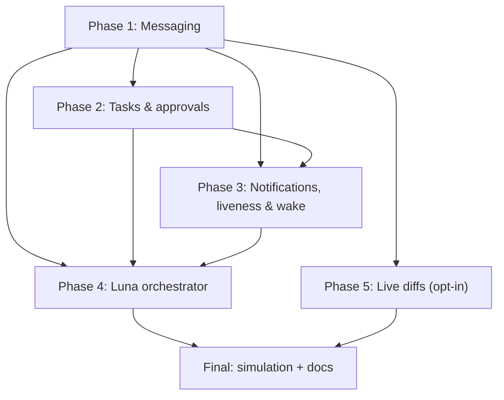

# Implementation Plan — CFLS V2: Collaboration Layer

## Overview

This plan turns the V2 design into an incremental, test-driven build on top of the
shipped V1 MVP. Work proceeds in phase order (1→5), and within each phase in stack
order: `protocol` → `core-state` → `host` → `agent` → `mcp-server` →
`vscode-extension` → tests. Every task ends by wiring into the running system, so
there is no orphaned code.

Scope is limited to `Documentation/idea.md` §6 — nothing extra is added. Each task
lists the requirement clauses it implements. Commit after every task/file. Keep
`pnpm typecheck` + `pnpm test` green. At each phase gate, merge `V2`→`main` with a
regular merge (never squash).

## Task Dependency Graph



Within every phase the internal order is fixed:
`protocol → core-state → host → agent → mcp → extension → tests → phase gate`.

Execution waves (each wave depends on the previous one completing):

```json
{
  "waves": [
    { "wave": 1, "name": "Phase 1 — Messaging", "tasks": ["1.1","1.2","1.3","1.4","1.5","1.6","1.7","1.8","1.9","1.10","1.11","1.12"] },
    { "wave": 2, "name": "Phase 2 — Tasks & approvals", "tasks": ["2.1","2.2","2.3","2.4","2.5","2.6","2.7","2.8","2.9","2.10","2.11"] },
    { "wave": 3, "name": "Phase 3 — Notifications, liveness & wake", "tasks": ["3.1","3.2","3.3","3.4","3.5","3.6","3.7","3.8","3.9"] },
    { "wave": 4, "name": "Phase 4 — Luna orchestrator", "tasks": ["4.1","4.2","4.3","4.4","4.5","4.6","4.7","4.8","4.9"] },
    { "wave": 5, "name": "Phase 5 — Live diffs (opt-in)", "tasks": ["5.1","5.2","5.3","5.4","5.5","5.6","5.7","5.8","5.9"] },
    { "wave": 6, "name": "Final — simulation & docs", "tasks": ["6.1","6.2","6.3"] }
  ]
}
```

## Tasks

### Phase 1 — Communication (Messaging)

- [x] 1.1 protocol: add `message.*` types + `MessageDto`, `MessageKind`,
      `MessagePriority` to `messages.ts`/`models.ts`; export from `index.ts`.
      _Requirements: 1.1–1.4_
- [x] 1.2 protocol: add validation schemas for `message.send`/`message.update`/
      `message.read` in `validation.ts`; unit tests. _Requirements: 1.1, 1.4_
- [x] 1.3 core-state: `messaging.ts` `MessageRegistry` (append, deliver/read state,
      question/answer correlation, own-message exclusion). _Requirements: 1.1–1.4_
- [x] 1.4 core-state: `messaging.property.test.ts` + `messaging.test.ts`
      (ordering, unread-count exclusion, Q/A matching). _Requirements: 1.3, 1.4_
- [x] 1.5 core-state: include messages in snapshot (`snapshot.ts`); reconnect
      delivery of missed messages handled host-side after sync. _Requirements: X.2_
- [x] 1.6 host: messages persisted via existing snapshot mechanism (no separate
      table needed — matches how locks/presence/intents persist). _Requirements: 1.4, X.2_
- [x] 1.7 host: `authority.ts` apply-branches for `message.*` (deliver to audience,
      auth checks, body value-scanned data-minimization); server delivery +
      missed-message resend on sync. _Requirements: 1.1–1.4, X.1_
- [x] 1.8 host: integration test — directed/broadcast/Q&A + offline reconnect. _Requirements: 1.1, 1.4, X.2_
- [x] 1.9 agent: port methods `sendMessage`/`markMessageRead`/`listMessages`/
      `listOpenQuestions` (ask/answer via sendMessage kind); view store; gateway +
      connection relay of `message.update`; dispatch routes. _Requirements: X.3_
- [x] 1.10 mcp: tools `send_message`, `list_messages`, `mark_message_read`,
      `ask_question`, `answer_question`, `list_open_questions`; tool tests.
      _Requirements: X.3_
- [ ] 1.11 extension: Messages section (inbox, priority styling, compose, Q/A);
      view-model tests. _Requirements: X.3_
- [x] 1.12 phase gate: `pnpm -r build` green; all changed packages green
      (protocol 71, core-state 307, host 65, mcp 28, extension 61, simulation 11).
      Merge to `main` deferred to the very end (per updated instruction).

### Phase 2 — Task management & human approvals

- [ ] 2.1 protocol: `task.*` types + `TaskDto`/`TaskStatus`; exports.
      _Requirements: 2.1–2.3_
- [ ] 2.2 protocol: validation schemas + tests for `task.assign`/`respond`/
      `progress`/`withdraw`/`update`. _Requirements: 2.1–2.3_
- [ ] 2.3 core-state: `tasks.ts` `TaskRegistry` (lifecycle state machine + auth
      rules + Task_List projection). _Requirements: 2.1–2.3_
- [ ] 2.4 core-state: `tasks.property.test.ts` + `tasks.test.ts` (legal transitions,
      assignee-only approval, withdraw rules). _Requirements: 2.2_
- [ ] 2.5 core-state: snapshot + sync integration for tasks; tests. _Requirements: X.2_
- [ ] 2.6 host: `task_items` store table; `authority.ts` apply-branches with audit.
      _Requirements: 2.2, 2.3, X.1_
- [ ] 2.7 host: integration test — assign→approve/reject→progress + reconnect.
      _Requirements: 2.2, X.2_
- [ ] 2.8 agent: port methods `assignTask`/`respondTask`/`progressTask`/`listTasks`;
      dispatch. _Requirements: X.3_
- [ ] 2.9 mcp: tools `assign_task`, `respond_to_task`, `update_task_progress`,
      `list_tasks`; tool tests. _Requirements: X.3_
- [ ] 2.10 extension: Tasks section (my list, incoming approvals, progress).
      _Requirements: X.3_
- [ ] 2.11 phase gate: green typecheck/tests; update memory; merge `V2`→`main`.

### Phase 3 — Notifications, liveness & wake

- [ ] 3.1 protocol: `liveness.update`, `wake.request`, `notify.push` +
      `LivenessState`/`NotificationDto`/`NotifySeverity`; exports + validation.
      _Requirements: 3.1–3.3_
- [ ] 3.2 core-state: `liveness.ts` `LivenessTracker` (active/idle/gone derivation)
      + notification-severity builder; property/unit tests. _Requirements: 3.1, 3.2_
- [ ] 3.3 host: liveness sweep + notification emission wired to the expiry sweep and
      message/task/question/conflict events; `notifications` table.
      _Requirements: 3.1–3.3_
- [ ] 3.4 host: wake handling (record + deliver at target's next action).
      _Requirements: 3.3_
- [ ] 3.5 host: integration test — liveness transitions, urgent notification, wake
      delivery. _Requirements: 3.1–3.3_
- [ ] 3.6 agent: port methods `getLiveness`/`wake`/`getNotifications`; dispatch.
      _Requirements: X.3_
- [ ] 3.7 mcp: tools `get_liveness`, `wake_member`, `get_notifications`; tests.
      _Requirements: X.3_
- [ ] 3.8 extension: liveness dots, wake action, severity notifications (+ sound on
      urgent). _Requirements: 3.2, 3.3_
- [ ] 3.9 phase gate: green typecheck/tests; update memory; merge `V2`→`main`.

### Phase 4 — Orchestration (Luna)

- [ ] 4.1 protocol: `luna.request`/`luna.reply` + `LunaAction`/`LunaRequestDto`/
      `LunaReplyDto`; exports + validation. _Requirements: 4.1–4.5_
- [ ] 4.2 core-state: `orchestrator.ts` `LunaBrain` interface + `RulesLunaBrain`
      (assign/arbitrate/answer/summarize, deterministic); property/unit tests.
      _Requirements: 4.1–4.4_
- [ ] 4.3 core-state: optional `LlmLunaBrain` adapter behind the same interface,
      inert unless injected; unit test proving default is rules-based.
      _Requirements: 4.1_
- [ ] 4.4 host: `LunaService` (reserved Luna member, handles `luna.request`, emits
      task.assign/message.send/luna.reply); disabled-LLM default.
      _Requirements: 4.1–4.5_
- [ ] 4.5 host: integration test — direct→assign, arbitrate ambiguous conflict,
      answer, summarize; reliability when Luna brain absent. _Requirements: 4.1–4.4_
- [ ] 4.6 agent: port method `askLuna`; dispatch. _Requirements: X.3_
- [ ] 4.7 mcp: tool `ask_luna`; tests. _Requirements: X.3_
- [ ] 4.8 extension: Luna chat panel (direct Luna, read summaries). _Requirements: 4.5_
- [ ] 4.9 phase gate: green typecheck/tests; update memory; merge `V2`→`main`.

### Phase 5 — Live diffs (opt-in)

- [ ] 5.1 protocol: `diff.share`/`diff.update` + `LiveDiffDto`; exports + validation.
      _Requirements: 5.1–5.5_
- [ ] 5.2 core-state: `diffs.ts` `DiffRegistry` (store latest per member/path when
      enabled; drop on stop/exclusion); tests. _Requirements: 5.2, 5.3_
- [ ] 5.3 config: team-shared opt-in flag (`.coordination/config.json` `liveDiffs`),
      default OFF; parse + tests. _Requirements: 5.1, 5.4_
- [ ] 5.4 host: `live_diffs` table + apply-branch (gated, data-minimized, no
      excluded paths). _Requirements: 5.1–5.3_
- [ ] 5.5 agent: local git-diff of the Authorized_Folder when enabled; `shareDiff`/
      `listDiffs` port methods + dispatch. _Requirements: 5.2, 5.3_
- [ ] 5.6 mcp: tools `share_diff`, `list_diffs`; tests. _Requirements: X.3_
- [ ] 5.7 extension: read-only live-diff view (never auto-applies). _Requirements: 5.5_
- [ ] 5.8 host/integration test — enabled vs disabled behavior parity with V1.
      _Requirements: 5.4_
- [ ] 5.9 phase gate: green typecheck/tests; update memory; merge `V2`→`main`.

### Final

- [ ] 6.1 extend the multi-agent simulation with a full
      message→task→approval→Luna(→optional diff) scenario. _Requirements: X.3, X.4_
- [ ] 6.2 update docs (`docs/`, `README`) to describe V2 features honestly.
      _Requirements: X.4_
- [ ] 6.3 final green typecheck/tests; final merge `V2`→`main`.

## Notes

- **No scope creep:** every task maps to an idea.md §6 capability and a V2
  requirement. Do not add features the idea document does not call for.
- **Reuse V1:** signing, replay protection, session scoping, ordering, sync,
  persistence, and audit are reused unchanged; V2 adds message families, not
  infrastructure.
- **Luna default is rules-based** and requires no external service; the optional LLM
  brain stays off by default (task 4.3).
- **Live diffs are the only source-derived content** and are opt-in/off by default
  (Phase 5); every other feature stays metadata + team text.
- **Commit discipline:** commit per task/file with `V2(phaseN/taskX): …`; merge to
  `main` with a regular merge at each phase gate so all commits stay on the graph.
