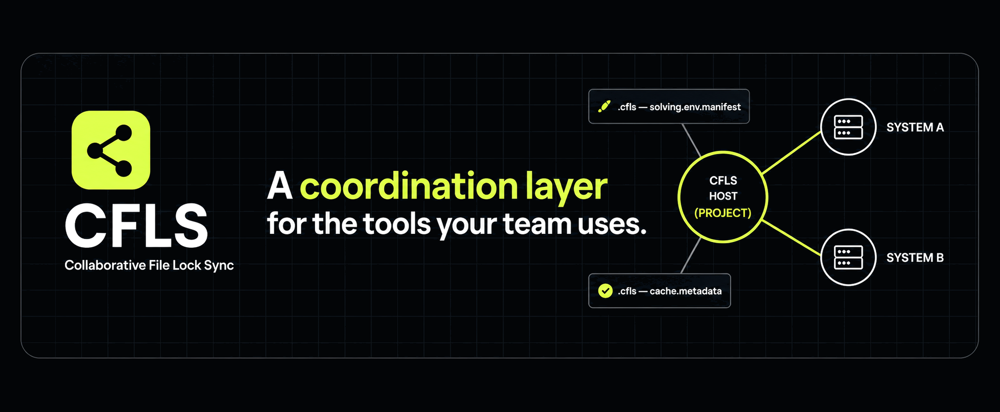
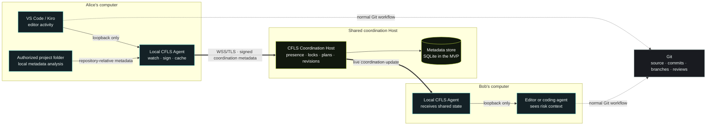
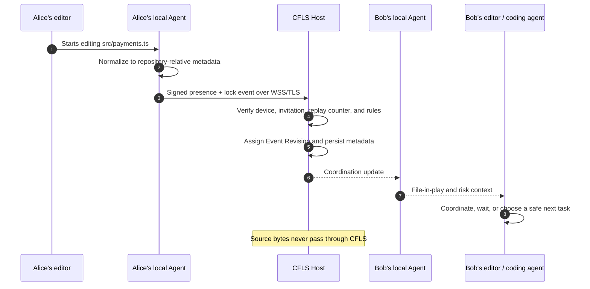
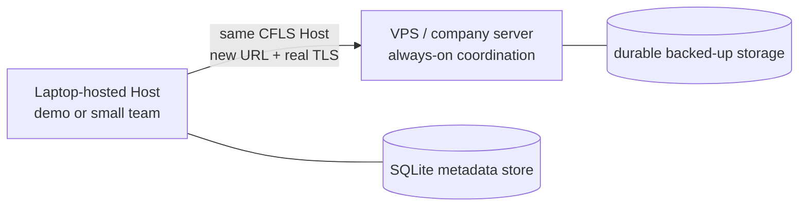

<p align="center">
  
</p>

<h1 align="center">CFLS — Collaborative File Lock Sync</h1>

<p align="center">
  A real-time, metadata-only coordination layer for developers and AI coding agents working in the same Git repository.
</p>

<p align="center">
  <strong>Host-based MVP:</strong> make active work visible before it becomes a surprise merge conflict.
</p>

## Contents

- [What CFLS is](#what-cfls-is)
- [The problem it solves](#the-problem-it-solves)
- [How the system works](#how-the-system-works)
- [What happens when someone edits](#what-happens-when-someone-edits)
- [What is shared—and what is not](#what-is-sharedand-what-is-not)
- [Risk and locking model](#risk-and-locking-model)
- [Current MVP scope](#current-mvp-scope)
- [Try it locally](#try-it-locally)
- [Set up a real team](#set-up-a-real-team)
- [Editors, coding agents, and MCP](#editors-coding-agents-and-mcp)
- [Security, privacy, and offline behavior](#security-privacy-and-offline-behavior)
- [Dashboard, deployment, and optional Git sync](#dashboard-deployment-and-optional-git-sync)
- [Build, test, and repository layout](#build-test-and-repository-layout)
- [Reference documentation](#reference-documentation)

## What CFLS is

CFLS helps a team answer one question before work overlaps:

> Is this file already in play, or can I safely start here?

It combines live editor activity, locks, declared work, planned file creation, and—where available—dependency metadata into a shared coordination view. A single Coordination Host is the authority for that view; a local CFLS Agent runs on every teammate's computer.

| CFLS does                                                                 | CFLS does not do                                      |
| ------------------------------------------------------------------------- | ----------------------------------------------------- |
| Shares live coordination metadata between cooperating teammates and tools | Replace Git, GitHub, pull requests, or code review    |
| Helps editors and coding agents see collisions before they start          | Upload or synchronize source files through the Host   |
| Assigns a stable order to competing coordination events                   | Act as an operating-system-level file lock            |
| Keeps a small team in sync through one Host                               | Promise that every possible merge conflict disappears |

Git remains the source of truth for source bytes, commits, branches, reviews, and remotes. CFLS provides the context around that Git workflow.

## The problem it solves

| Without a shared signal                                                        | With CFLS                                                                                           |
| ------------------------------------------------------------------------------ | --------------------------------------------------------------------------------------------------- |
| Alice and Bob both open `src/payments.ts` without knowing the other is active. | Alice's Agent reports metadata that the file is in play; Bob sees it before changing the same path. |
| The overlap is discovered at save, merge, review, or release time.             | Bob can coordinate with Alice, wait, or choose a safe next task.                                    |
| Git is asked to resolve an avoidable collision after the work is already done. | Git still handles source control, but fewer collisions reach Git in the first place.                |

The goal is not to add a second source of truth. It is to give people and local coding agents a quiet, trustworthy signal early enough to make a better decision.

## How the system works



The local Agent is the boundary between a person's tools and the network. The editor extension and a coding agent talk to that local Agent; they do not connect directly to the network Host.

### The main components

| Component                          | Responsibility                                                                                                                                |
| ---------------------------------- | --------------------------------------------------------------------------------------------------------------------------------------------- |
| **Coordination Host**              | Validates identity and events, assigns monotonic revisions, resolves contested claims, persists metadata, and broadcasts updates.             |
| **Local CFLS Agent**               | Watches the authorized repository, normalizes/coalesces metadata, signs events, maintains an encrypted cache, and exposes local integrations. |
| **VS Code / Kiro extension**       | Turns editor activity into local events and presents coordination status through a clickable CFLS team status item and panel.                 |
| **Local MCP bridge**               | Gives a coding agent a machine-readable Risk Map, active-team status, and a way to declare intent or acquire/release coordination locks.      |
| **Shared protocol and core state** | Own the versioned messages, validation, lock/intent rules, risk calculation, and replay/idempotency behavior.                                 |

## What happens when someone edits



The Host—not a client timestamp—decides the ordering. Each accepted event receives a strictly increasing `Event Revision` within its session. When two claims conflict, the earliest accepted revision wins and the other client receives the context it needs to respond deliberately.

## What is shared—and what is not

CFLS is deliberately data-minimizing. It coordinates a repository using metadata, not code content.

| Shared coordination metadata                                                  | Never transmitted through CFLS                                                                    |
| ----------------------------------------------------------------------------- | ------------------------------------------------------------------------------------------------- |
| Repository-relative paths, team/session identifiers, branch context           | Source files, comments, string bodies, or full file contents                                      |
| Presence, locks, declared intents, planned file creation                      | Secrets, `.env` values, private keys, certificates, or Git credentials                            |
| Dependency edges, manifest fields, and fingerprints where available           | Absolute filesystem paths                                                                         |
| Device/member identity, revisions, audit metadata, connection/staleness state | `node_modules`, build outputs, caches, `.git`, vendor folders, virtual environments, and binaries |

Metadata is still shared with the Host and the authorized team, so it should be treated as operationally sensitive. It is not correct to say that nothing leaves a teammate's machine; source content is what stays out of the coordination channel.

Each coordination session is scoped to the canonical Git remote, team, branch, and base revision. Two folders on different computers can therefore coordinate as the same project without sharing their absolute paths.

## Risk and locking model

CFLS defaults to awareness, not interruption. Teams can make a path more restrictive when its risk justifies it.

| Level                   | Meaning                                                              | Expected behavior                                                                                                                    |
| ----------------------- | -------------------------------------------------------------------- | ------------------------------------------------------------------------------------------------------------------------------------ |
| `soft`                  | Someone may already be working nearby.                               | Show awareness and let the teammate decide. This is the default.                                                                     |
| `coordination-required` | A direct or dependency-related collision needs an explicit decision. | Require acknowledgement/override with a reason before proceeding.                                                                    |
| `hard`                  | A protected path is actively held.                                   | A CFLS-aware client receives a clear stop decision; VS Code/Kiro surfaces a pre-save warning until the lock is released or resolved. |

Hard mode is coordination policy, not a filesystem permission system. A non-CFLS editor, script, or operating-system process can still modify a file. The system is designed to make the safe action obvious and enforce it where the integration can cooperate.

## Current MVP scope

CFLS is a host-based MVP, not a peer-to-peer or serverless system. The table below distinguishes the working demo path from areas that remain product work.

| Available in the MVP                                                                               | In architecture / active product work                                              |
| -------------------------------------------------------------------------------------------------- | ---------------------------------------------------------------------------------- |
| Host and local Agent over WSS/TLS                                                                  | Dependency-aware impact as a polished end-user workflow                            |
| Per-device identity, signed invitations, revocation, and rotation                                  | Broader protected-path and hard-stop workflows                                     |
| Editor activity, live presence, soft coordination signals, and a read-only Host dashboard          | Production deployment guidance beyond a properly configured Host, TLS, and backups |
| Clickable VS Code / Kiro CFLS status item with live team roster plus active task and file metadata | Additional editor integrations and presentation refinements                        |
| MCP stdio bridge (`cfls mcp`) with the 13-tool coordination surface, including `get_team_status`   | Further coding-agent client integrations                                           |
| Per-user Agent service install on Linux (`systemd --user`) and Windows (Task Scheduler)            | Distribution and fleet-management refinements                                      |
| Offline cached state with clear staleness                                                          |                                                                                    |

Optional Git synchronization exists as a separate, opt-in layer; it is disabled by default and does not change the fact that Git owns source content and real conflict resolution.

## Try it locally

### Prerequisites

- Node.js `>=20`
- Corepack with the repository-pinned pnpm version (`11.13.1`)
- Git, plus VS Code or Kiro if you want to watch the editor integration

### Interactive playground

The fastest way to understand CFLS is to start one real Host and three simulated teammates on one laptop.

```bash
corepack enable
pnpm install
pnpm playground
```

The playground creates `playground/alice`, `playground/bob`, and `playground/carol`, starts a Host at `wss://127.0.0.1:8730`, and gives the three local Agents fixed Local API ports `8751`, `8752`, and `8753`.

1. Open the generated teammate folders in separate VS Code or Kiro windows.
2. Edit `src/shared.ts` in one workspace.
3. Watch the other workspace(s) receive the presence and coordination signal.
4. Open the local dashboard at `https://localhost:8730/dashboard`.
5. Press `Ctrl+C` in the playground terminal when you are finished.

The playground uses a development self-signed TLS certificate, so the first browser visit may show a local certificate warning. Do not use this development trust model for a production Host.

### Narrated terminal demo

```bash
pnpm demo
```

This walks through presence propagation, direct conflict handling, declared intent, dependency-related risk, and lock release without requiring multiple editor windows.

## Set up a real team

For the full multi-laptop guide, see [team onboarding](./docs/onboarding.md). The short version is below.

### 1. An admin creates the team identity and starts the Host

Run these from the shared repository after building the workspace:

```bash
pnpm -r build
pnpm --filter @cfls/cli exec cfls admin-init --team my-team
pnpm --filter @cfls/cli exec cfls host --url wss://0.0.0.0:8730 --db ./cfls-host.db
```

Without `--cert` and `--key`, the Host uses a development self-signed certificate. That is suitable only for a controlled demo or local development; Agents connecting to it need `--insecure-tls`.

### 2. Each teammate registers their own device

From the same Git repository on that teammate's computer:

```bash
pnpm --filter @cfls/cli exec cfls join --host wss://HOST-IP:8730 --name alice --team my-team
pnpm --filter @cfls/cli exec cfls id
```

Send the displayed public key to the admin. The admin issues a signed invitation:

```bash
pnpm --filter @cfls/cli exec cfls invite alice <alice-device-public-key>
```

### 3. The teammate connects their local Agent

```bash
pnpm --filter @cfls/cli exec cfls connect <invitation>
pnpm --filter @cfls/cli exec cfls agent --insecure-tls
```

Every teammate must coordinate the same Git remote, branch, and base revision. For production, use a reachable DNS name or stable address, a real certificate via `cfls host --cert <pem> --key <pem>`, durable storage, and omit `--insecure-tls`.

### Optional: keep the local Agent running in the background

The service command starts the same local Agent for this workspace. It does not grant it access
to source content beyond the authorized folder watcher, and it shares only coordination metadata.

```bash
# Linux: installs and starts a per-user systemd unit
pnpm --filter @cfls/cli exec cfls service install --workspace /absolute/repo/path

# Windows: creates a per-user Task Scheduler task; identify the task principal explicitly
pnpm --filter @cfls/cli exec cfls service install --workspace C:\path\to\repo \
  --windows-user 'DOMAIN\User-or-SID'

# Either platform
pnpm --filter @cfls/cli exec cfls service status --workspace /absolute/repo/path
pnpm --filter @cfls/cli exec cfls service uninstall --workspace /absolute/repo/path
```

For a development Host using a self-signed certificate, add `--insecure-tls` to the install
command. Linux users who need the Agent to survive logout may also need to enable lingering for
their account with their system administrator's policy.

### Install the editor extension

The packaged extension can be installed in VS Code or Kiro:

```bash
code --install-extension release/cfls-coordination.vsix --force
kiro --install-extension release/cfls-coordination.vsix --force
```

It speaks only to the local Agent through an authenticated loopback connection; it never dials the team Host directly. The bottom status-bar item shows the CFLS mark and current team. Click it (or run **CFLS: Show Coordination Status**) to open the active-team panel.

## Editors, coding agents, and MCP

The CFLS extension surfaces coordination status in VS Code/Kiro. A local MCP bridge exposes the
same machine-readable coordination state to coding agents without granting them direct network
access to the Host. Start `cfls agent` first; `cfls mcp` then connects only to that running
Agent's authenticated loopback API.

| Group                       | Local MCP tools                                                                            |
| --------------------------- | ------------------------------------------------------------------------------------------ |
| Risk and dependency context | `get_risk_map`, `get_dependency_impact`, `get_dependencies`, `get_dependents`              |
| Team activity               | `get_team_status`                                                                          |
| Intent                      | `declare_intent`, `update_intent`, `withdraw_intent`                                       |
| Locks                       | `acquire_lock`, `release_lock`                                                             |
| Live project state          | `subscribe_to_coordination_updates`, `get_connection_status`, `get_project_session_status` |

Configure the MCP client to launch the bridge from the repository being coordinated. The exact
outer configuration key varies by client; the process definition is:

```json
{
  "command": "cfls",
  "args": ["mcp", "--workspace", "/absolute/repo/path"]
}
```

Every MCP result carries connection and staleness information. `get_team_status` returns active
members, their declared task descriptions, and repository-relative file/activity metadata. The
VS Code/Kiro status item opens the same kind of active-team view: select a member to inspect the
tasks and files currently attributed to them. Neither surface transmits source text, file
patches, or diffs. A member's own active work is excluded from that member's Risk Map so the
result focuses on possible conflicts with others. See the [protocol's MCP tool surface](./docs/protocol.md#mcp-tool-surface) for schemas and responses.

## Security, privacy, and offline behavior

| Boundary              | Protection                                                                                                           |
| --------------------- | -------------------------------------------------------------------------------------------------------------------- |
| Device identity       | Each device has its own Ed25519 key, stored locally in secure storage with an encrypted fallback.                    |
| Team membership       | An authorized admin signs invitations; the Host validates membership, supports revocation, and accepts key rotation. |
| Network traffic       | Agent-to-Host traffic uses WSS/TLS, followed by a challenge-response handshake and signed state-changing events.     |
| Replay and duplicates | A per-device monotonic counter and nonce reject replay; a duplicate event ID is idempotent.                          |
| Local integrations    | The Local API is loopback-only and protected by a per-session token.                                                 |
| Auditability          | Coordination-required overrides require a reason and create metadata-only audit records.                             |

When the Host cannot be reached, the Agent may serve cached coordination state, clearly marked stale. It never claims that a hard lock is safe while offline; mutations are queued or rejected instead of being falsely reported as Host-accepted. On reconnect, the Agent syncs from its last applied revision or replaces its state with a Host snapshot.

For the full trust-boundary analysis and error model, read the [security and threat model](./docs/threat-model.md).

## Dashboard, deployment, and optional Git sync

### Read-only Host dashboard

Open `https://<host>/dashboard` to view live sessions, connected devices, locks, editing presence, and planned file creation. It intentionally contains coordination metadata only. It can be disabled with `CFLS_DASHBOARD=false`.

Treat the dashboard as a trusted-network operational view. Do not expose it publicly without putting appropriate network controls or an access layer in front of the Host, because file paths, member names, and activity metadata are still sensitive.

### Laptop now, always-on Host later

The same Host configuration can run on a teammate's laptop for a demo or small session, then move to a VPS or company server for an always-on team setup.



For a persistent deployment, keep the Host reachable, use a valid certificate, back up the durable database, and run it under an appropriate process supervisor. SQLite is the current MVP store behind a DAO; PostgreSQL is a future replacement path, not a required current service.

### Optional Git sync

CFLS can optionally help move coordinated changes using per-user branches such as `cfls/alice`. It is off by default. When enabled, it publishes only the current member's coordinated changes, never force-pushes, and can optionally auto-merge only conflict-free work. Any genuine conflict remains a human decision.

Use this only after reading the [feature guide's Git sync section](./docs/features.md#4-automatic-git-sync-optional-model-a). It supplements Git; it does not replace Git credentials, review, or merge judgement.

## Build, test, and repository layout

### Common commands

```bash
pnpm typecheck
pnpm -r build
pnpm test
pnpm --filter @cfls/simulation test
```

The test strategy combines unit tests, property-based tests with `fast-check`, WSS/SQLite/MCP integration tests, and a five-agent local simulation that covers presence, conflicts, expiry, reconnection, and unauthorized devices.

### Package and release artifacts

```bash
# Build the self-contained VS Code / Kiro extension package
pnpm -C apps/vscode-extension package:vsix

# Build the Windows CLI executable
pnpm -C apps/cli package:win
```

The VSIX is written to `apps/vscode-extension/vsix-pkg/cfls-coordination.vsix`. The Windows executable is written to `apps/cli/dist-exe/cfls.exe`; large executables should be shipped through a GitHub Release or an internal distribution channel rather than committed to Git history.

### Repository map

```text
apps/
  host/                 Coordination Host: WSS, authority, persistence, dashboard
  agent/                Local Agent: watcher, cache, and authenticated Local API
  cli/                  cfls onboarding, Host, Agent, MCP bridge, service, invitation, and sync commands
  vscode-extension/     VS Code / Kiro integration and clickable team status panel
packages/
  protocol/             Versioned messages, DTOs, schemas, error codes
  core-state/           Locks, presence, intent, risk, and conflict rules
  dependency-analyzer/  Metadata-only dependency analysis
  mcp-server/           Local machine-readable coordination tools
  security/             Ed25519 keys, signing, invitations, replay, secure storage
tests/
  demo/                 Narrated and interactive local demo
  simulation/           Multi-agent end-to-end scenarios
website/                Static product site and walkthrough
docs/                   Architecture, protocol, security, deployment, onboarding, testing
```

## Reference documentation

| Topic                                              | Read next                                    |
| -------------------------------------------------- | -------------------------------------------- |
| Product story and visual walkthrough               | [Website guide](./website/README.md)         |
| Joining a real team                                | [Onboarding](./docs/onboarding.md)           |
| System components and trust zones                  | [Architecture](./docs/architecture.md)       |
| Handshake, event envelope, sync, and MCP schemas   | [Protocol](./docs/protocol.md)               |
| Identity, privacy, replay safety, and STRIDE model | [Threat model](./docs/threat-model.md)       |
| Laptop and VPS operation                           | [Deployment](./docs/deployment.md)           |
| Features and optional Git sync                     | [Feature guide](./docs/features.md)          |
| Correctness properties and simulation coverage     | [Testing strategy](./docs/testing.md)        |
| Demo instructions                                  | [Single-laptop demo](./tests/demo/README.md) |
| VSIX and CLI artifacts                             | [Release guide](./release/README.md)         |

---

CFLS is coordination software: it helps a team see the next collision early enough to avoid it, while leaving source control where it belongs—Git.
