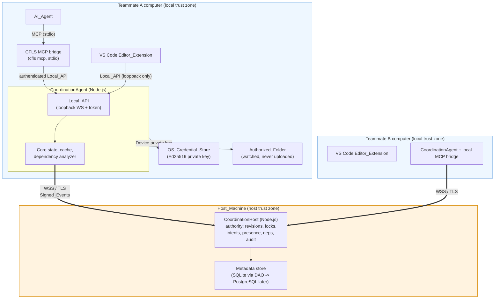
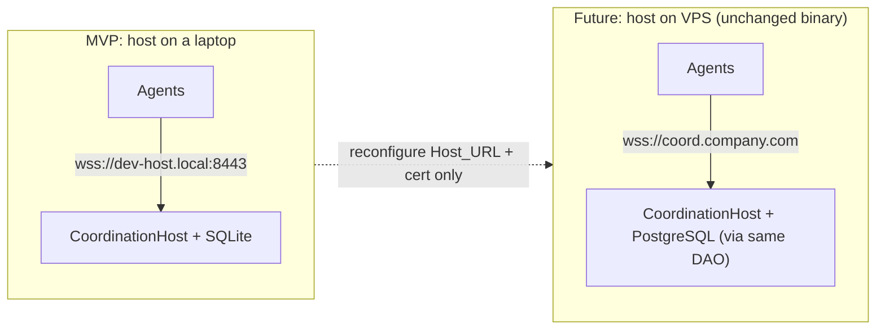
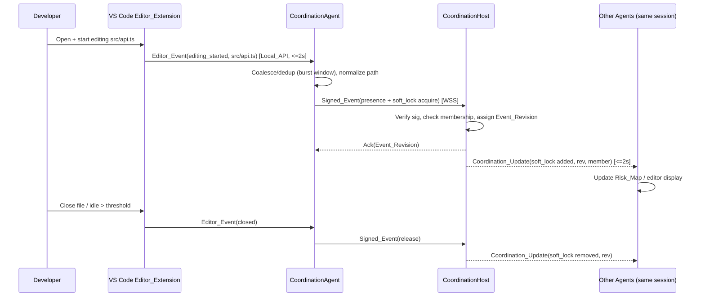
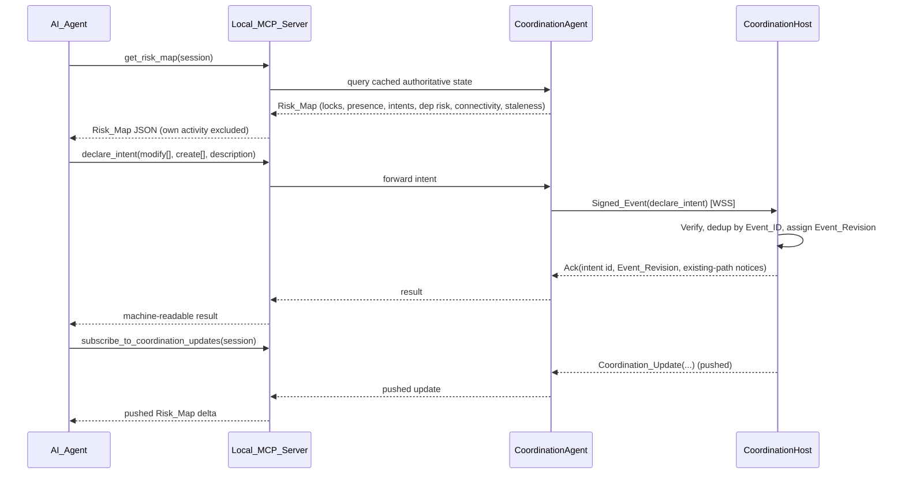

# Architecture

> Living architecture doc for **Collaborative File Lock Sync (Host-Based MVP)**.
> Seeded from the design's "Architecture" and "Components and Interfaces" sections.
> Related docs: [protocol.md](./protocol.md) · [threat-model.md](./threat-model.md) · [deployment.md](./deployment.md) · [testing.md](./testing.md)

## Overview

Multiple developers — and increasingly multiple AI coding agents acting on their
behalf — edit the same shared repository concurrently. The system gives an AI_Agent a
machine-readable, real-time signal it can query **before** it edits or creates a file:

1. Which files is someone changing **right now**? (active Soft_Locks + Presence_Events)
2. Which files **will or might** change? (Declared_Intents + Planned_File_Creations)
3. Which files are **indirectly at risk** because they depend on files being changed
   elsewhere? (dependency-aware coordination)

Together these form a **Risk_Map** an AI_Agent can act on programmatically. The primary
consumer is the **AI_Agent**; the VS Code extension is a secondary, human-facing consumer.
Every coordination result is emitted as JSON with explicit `Risk_Level`, contributing member
identities, explanation paths, connectivity status, and staleness indicators.

**No source content is ever transmitted** — the system is metadata-only.

## Trust Zones

Two trust boundaries matter:

- **Local trust zone** (one teammate's computer): Editor_Extension, AI_Agent,
  the `cfls mcp` stdio bridge, CoordinationAgent, OS credential store, Authorized_Folder.
  Everything here is loopback-only.
- **Network trust zone** (WSS/TLS): the single authenticated channel between each
  CoordinationAgent and the CoordinationHost.
- **Host trust zone** (Host_Machine): CoordinationHost + its metadata store.

See [threat-model.md](./threat-model.md) for the full trust-boundary and STRIDE analysis.

## Component Diagram



## Deployment View (laptop now → VPS later, unchanged)

The CoordinationHost is a standalone Node process listening on a configured address. Moving
from laptop to VPS changes only `Host_URL` and the TLS certificate; no code change. Full
detail lives in [deployment.md](./deployment.md).



## Data Flow — Human Edit Flow



## Data Flow — AI Agent Flow



## Components and Interfaces

All components are TypeScript. The public contracts are summarized below; concrete DTOs
live in `packages/protocol`. Wire-level contracts are documented in [protocol.md](./protocol.md).

### CoordinationHost (`apps/host`)

The **definitive authority**: device/membership/invitation/revocation validation,
Signed_Event verification, idempotency and replay protection, schema validation, monotonic
Event_Revision assignment and conflict resolution, locks, presence broadcast, intents,
dependency-graph storage and risk computation, subscriptions/broadcast, heartbeats and
expiry, health/diagnostics, audit, data-minimization rejection, rename/move/delete, session
scoping, and durable persistence with restart recovery.

```typescript
interface CoordinationHost {
  start(config: HostConfig): Promise<void>; // start within 10s
  handleConnection(conn: AgentConnection): Promise<void>; // auth handshake
  ingest(event: SignedEvent): Promise<IngestResult>; // verify + apply
  syncFrom(session: SessionId, fromRevision: number): Promise<SyncResponse>;
  health(): HealthStatus;
  diagnostics(): DiagnosticsReport;
}

interface IngestResult {
  accepted: boolean;
  eventRevision?: number; // assigned revision when accepted
  duplicateOf?: number; // idempotent replay of Event_ID
  error?: ErrorCode;
  conflict?: ConflictInfo;
}
```

### CoordinationAgent (`apps/agent`)

Per-user agent on each teammate's computer: one outbound WSS connection, localhost-only
Local_API, watches only the Authorized_Folder (never modifies it), Ed25519 key gen/storage,
dependency-graph building,
Offline_State + backoff, reconnect sync + re-assert, coalescing/dedup, local encrypted
cache, multi-client fan-in under one identity, and path-change/deletion notifications.

```typescript
interface CoordinationAgent {
  bootstrap(): Promise<void>; // key, cache, Local_API, connect
  connect(hostUrl: string): Promise<void>; // WSS, exponential backoff
  submit(intent: LocalMutation): Promise<MutationResult>;
  getRiskMap(session: SessionId, requesterId: ClientId): RiskMap; // own activity excluded
  onCoordinationUpdate(cb: (u: CoordinationUpdate) => void): void;
  connectionStatus(): ConnectionStatus;
  state(): "online" | "offline";
}
```

### Local_API

Loopback-only channel between the Editor_Extension / AI_Agent and the agent. The shipped CLI
uses an authenticated loopback WebSocket on every supported OS, requiring a per-session
`Local_Auth_Token`. The agent also has an optional Windows named-pipe transport for integrations
that explicitly enable it; the VS Code extension and stdio MCP bridge use the documented
WebSocket endpoint. The server rejects any non-loopback origin and refuses clients if it cannot
bind.

```typescript
interface LocalApi {
  authenticate(token: string): Promise<ClientId>;
  send(msg: LocalRequest): Promise<LocalResponse>;
  subscribe(session: SessionId): AsyncIterable<CoordinationUpdate>;
}
```

### Local_MCP_Server and stdio bridge (`packages/mcp-server`, `apps/cli`)

Built on `@modelcontextprotocol/sdk` and exposed over stdio by
`cfls mcp --workspace /absolute/repo/path`. The bridge authenticates to the already-running
local Agent's Local_API; it never opens a second Host connection. It exposes exactly **13
tools**. Every response is machine-readable and carries `connection` and `staleness`
envelopes. The full tool catalog and schemas are documented in
[protocol.md](./protocol.md#mcp-tool-surface). The 13 tools:

`get_risk_map`, `get_team_status`, `get_dependency_impact`, `get_dependencies`, `get_dependents`,
`declare_intent`, `update_intent`, `withdraw_intent`, `acquire_lock`, `release_lock`,
`subscribe_to_coordination_updates`, `get_connection_status`, `get_project_session_status`.

Common response envelope:

```typescript
interface McpEnvelope<T> {
  ok: boolean;
  data?: T;
  error?: { code: ErrorCode; message: string; details?: unknown };
  connection: {
    status: "online" | "offline";
    hostUrl: string;
    lastSyncAt: string | null;
  };
  staleness: { stale: boolean; secondsSinceSync: number | null };
}
```

### Editor_Extension (`apps/vscode-extension`)

Talks only to the Local_API (never to the host). Emits Editor_Events within 2s, renders
coordination state within 2s, enforces hard-stop for cooperating edits, shows offline/stale
indicators, and sends heartbeats to the agent. Its CFLS status-bar item opens an active-team
panel with member task and repository-relative file metadata; it does not display or transmit
source patches or diffs.

```typescript
type EditorEventKind =
  | "workspace_opened"
  | "file_opened"
  | "active_editor_changed"
  | "editing_started"
  | "file_saved"
  | "file_closed"
  | "file_renamed"
  | "file_deleted";
```

### Shared protocol package (`packages/protocol`)

Owns the versioned message envelope, message catalog, DTOs, error codes, and JSON schemas
shared by host, agent, mcp-server, and extension. Single source of truth for wire
compatibility (`MESSAGE_FORMAT_VERSION`). See [protocol.md](./protocol.md).

## Key Design Decisions

- **Host-authority vs P2P (MVP):** a single authoritative host gives one consistent total
  order (Event_Revision) and one place to validate membership, sign-off, and audit. P2P is
  deferred; the authoritative-ordering contract is preserved so it can layer on later.
- **WSS vs QUIC:** WSS over TLS is universally supported, gives persistent bidirectional
  streams, and is trivial to secure with standard certs. The envelope is transport-agnostic,
  leaving QUIC as a future option.
- **SQLite behind a DAO:** zero setup for laptop-hosted development, durable enough for MVP,
  and swappable for PostgreSQL later without behavior change.
- **Ed25519 device keys:** small, fast, per-device identity enabling targeted revocation and
  rotation. Fail closed if the OS credential store is unavailable.
- **Local_API transport:** the deployed CLI uses an authenticated loopback WebSocket with a
  per-session token on Windows and Linux so the extension and stdio bridge share one documented
  endpoint. A Windows named-pipe transport remains optional for integrations that explicitly
  enable it; it is not the default deployment path.
