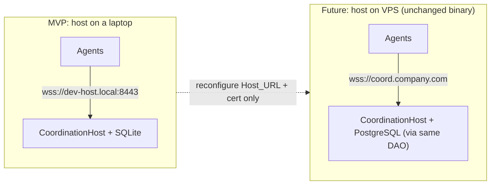

# Deployment

> Living deployment doc for **Collaborative File Lock Sync (Host-Based MVP)**.
> Seeded from the design's deployment view, project structure, and packaging notes.
> Related docs: [architecture.md](./architecture.md) · [protocol.md](./protocol.md) ·
> [threat-model.md](./threat-model.md)

## Deployment Model: laptop now → VPS later, unchanged

The CoordinationHost is a standalone Node process listening on a configured address. The MVP
runs the host **on a developer's laptop**; it later moves **unchanged** to a VPS or company
server. Moving between them changes only the configured `Host_URL` and the TLS certificate —
no code change.



## Host_URL Configuration

- The host listens at a **configurable `Host_URL`** over WSS/TLS — there is **no hardcoded
  address**. It must start and accept agent connections within 10s.
- Each agent dials the same configured `Host_URL`. Certificate validation is mandatory; on
  failure the agent refuses the connection and enters Offline_State.
- Relocating the host (laptop → VPS) is purely a matter of reconfiguring `Host_URL` and
  supplying the matching TLS certificate.

## Running the host with the `cfls` CLI

The `cfls` CLI (`@cfls/cli`) wraps `startHost` for real onboarding. See
[onboarding.md](./onboarding.md) for the full admin/teammate flow. Host-relevant commands:

```bash
cfls admin-init --team my-team          # once: create the admin key + ~/.cfls/host.json
cfls host --url wss://0.0.0.0:8730 \     # dev: self-signed TLS (warns; agents use --insecure-tls)
          --db ~/.cfls/host.db
cfls host --url wss://coord.company.com:8730 \
          --cert /etc/cfls/fullchain.pem --key /etc/cfls/privkey.pem   # production
```

- `--url` sets the `Host_URL`. Bind to `0.0.0.0` to accept LAN/WAN connections; the printed
  URL shows `<this-machine-ip>` as a reminder to advertise the reachable address to teammates.
- `--cert` / `--key` (or `CFLS_TLS_CERT` / `CFLS_TLS_KEY`) supply a **real** certificate for
  production. Without them the host generates a **development self-signed** certificate and
  warns; teammates must then pass `cfls agent --insecure-tls`.
- `--db` sets the SQLite path (durable; survives restarts). Defaults to `host.db` in the cwd.
- `cfls host` registers the repo's session from git (or `--repo <url>`) with the authorized
  admin public keys from `~/.cfls/host.json`, then runs until Ctrl+C (SIGINT stops cleanly).

## Deploying the host on a VPS (always-on)

For a team that is not all online at once, run the host on an always-on VPS or company server:

1. **Provision & open the port.** Install Node ≥ 20, copy the built host (or the CLI), and
   open the chosen WSS port (e.g. `8730`) in the VPS firewall / security group. Only the
   single WSS port needs to be reachable.
2. **Real TLS certificate.** Obtain a certificate for the host's DNS name (e.g. via Let's
   Encrypt) and pass `--cert`/`--key`. This gives agents a verifiable identity — do **not**
   use `devSelfSigned`/`--insecure-tls` in production.
3. **Configurable `Host_URL`.** Set `--url wss://coord.company.com:8730` (or `CFLS_HOST_URL`).
   Teammates dial this exact URL via `cfls join --host wss://coord.company.com:8730`.
4. **Keep it always-on.** Run under a process supervisor (systemd, pm2, or a container with a
   restart policy) so it restarts on crash/reboot. State is restored from the SQLite DB on
   restart, and the revision counter resumes above every persisted revision.
5. **Persistent storage.** Point `--db`/`CFLS_DB_PATH` at durable disk (backed up) so
   coordination history survives host restarts.

## Laptop host: reachability caveats

A laptop-hosted host works for co-located/short sessions but has real limits:

- The laptop must stay **powered on, awake, and reachable** for teammates to coordinate; if it
  sleeps or disconnects, agents drop to Offline_State (they keep serving the cached view and
  reconnect automatically when the host returns).
- On a home/office NAT you must **port-forward** the WSS port to the laptop (and account for a
  changing public IP) so remote teammates can connect. On the same LAN, teammates use the
  laptop's LAN IP.
- Because the binary and configuration are identical, moving from a laptop to a VPS later is
  just a change of `Host_URL` and TLS material — no code change.

## Hosting Notes

- **Storage:** SQLite for the laptop MVP (zero setup, durable enough for MVP team sizes;
  single-writer concurrency is acceptable at this scale). It sits behind a `Store` DAO so
  PostgreSQL can replace it later **without behavior change** — the migration is a future
  consideration behind the existing interface.
- **Transport:** WSS over TLS, universally supported by Node, proxies, and firewalls. The
  message envelope is transport-agnostic, leaving QUIC as a future option (see
  [protocol.md](./protocol.md)).
- **Persistence & recovery:** the host durably persists events and audit records and restores
  authoritative state plus revision counters on restart (the revision counter resumes above
  every persisted revision for the session).

## Project Structure

Monorepo using **pnpm workspaces** (npm workspaces acceptable), a shared `tsconfig` base,
TypeScript project references, and `tsup`/`esbuild` for builds.

```
collaborative-file-lock-sync/
├─ apps/
│  ├─ host/                 # CoordinationHost server (WSS, ingest, authority)
│  ├─ agent/                # CoordinationAgent (WSS client, Local_API, watcher, cache)
│  ├─ cli/                  # `cfls` onboarding CLI (admin-init/host/id/invite/join/connect/agent)
│  └─ vscode-extension/     # VS Code Editor_Extension
├─ packages/
│  ├─ protocol/             # envelope, message catalog, DTOs, error codes, JSON schemas, version
│  ├─ core-state/           # locks/presence/intents/risk state machine (pure, PBT target)
│  ├─ dependency-analyzer/  # metadata-only analyzers (TS/JS first, pluggable)
│  ├─ mcp-server/           # Local_MCP_Server (@modelcontextprotocol/sdk), 12 tools
│  └─ security/             # Ed25519 keys, signing, invitations, replay, credential store
├─ docs/
│  ├─ architecture.md  ├─ protocol.md  ├─ threat-model.md  ├─ deployment.md  ├─ testing.md
├─ tests/
│  ├─ unit/  ├─ integration/  └─ simulation/   # 5-agent local multi-agent sim
├─ package.json (workspaces)  ├─ pnpm-workspace.yaml  └─ tsconfig.base.json
```

## Agent Packaging & Startup

- The agent is built into a **Windows executable via Node SEA** (fallback `pkg`).
- Per-user login startup is registered via the **HKCU Run registry key / Startup folder** —
  **no administrator privileges required**.
- The agent stores its Ed25519 private key in the OS credential store (with an encrypted-file
  fallback) and fails closed if secure storage is unavailable. See
  [threat-model.md](./threat-model.md) for identity and key-custody details.
