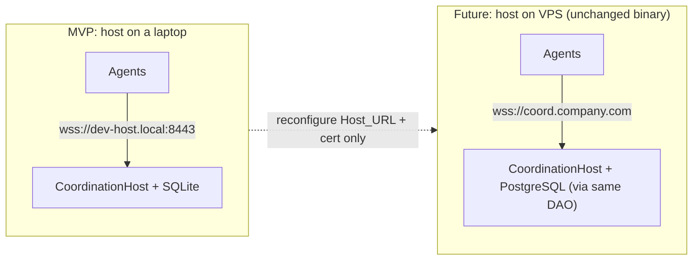

# Deployment

> Living deployment doc for **Collaborative File Lock Sync (Host-Based MVP)**.
> Seeded from the design's deployment view, project structure, and packaging notes.
> Related docs: [architecture.md](./architecture.md) · [protocol.md](./protocol.md) ·
> [threat-model.md](./threat-model.md)

## Deployment Model: laptop now → VPS later, unchanged

The CoordinationHost is a standalone Node process listening on a configured address. The MVP
runs the host **on a developer's laptop**; it later moves **unchanged** to a VPS or company
server. Moving between them changes only the configured `Host_URL` and the TLS certificate —
no code change.



## Host_URL Configuration

- The host listens at a **configurable `Host_URL`** over WSS/TLS — there is **no hardcoded
  address**. It must start and accept agent connections within 10s.
- Each agent dials the same configured `Host_URL`. Certificate validation is mandatory; on
  failure the agent refuses the connection and enters Offline_State.
- Relocating the host (laptop → VPS) is purely a matter of reconfiguring `Host_URL` and
  supplying the matching TLS certificate.

## Hosting Notes

- **Storage:** SQLite for the laptop MVP (zero setup, durable enough for MVP team sizes;
  single-writer concurrency is acceptable at this scale). It sits behind a `Store` DAO so
  PostgreSQL can replace it later **without behavior change** — the migration is a future
  consideration behind the existing interface.
- **Transport:** WSS over TLS, universally supported by Node, proxies, and firewalls. The
  message envelope is transport-agnostic, leaving QUIC as a future option (see
  [protocol.md](./protocol.md)).
- **Persistence & recovery:** the host durably persists events and audit records and restores
  authoritative state plus revision counters on restart (the revision counter resumes above
  every persisted revision for the session).

## Project Structure

Monorepo using **pnpm workspaces** (npm workspaces acceptable), a shared `tsconfig` base,
TypeScript project references, and `tsup`/`esbuild` for builds.

```
collaborative-file-lock-sync/
├─ apps/
│  ├─ host/                 # CoordinationHost server (WSS, ingest, authority)
│  ├─ agent/                # CoordinationAgent (WSS client, Local_API, watcher, cache)
│  └─ vscode-extension/     # VS Code Editor_Extension
├─ packages/
│  ├─ protocol/             # envelope, message catalog, DTOs, error codes, JSON schemas, version
│  ├─ core-state/           # locks/presence/intents/risk state machine (pure, PBT target)
│  ├─ dependency-analyzer/  # metadata-only analyzers (TS/JS first, pluggable)
│  ├─ mcp-server/           # Local_MCP_Server (@modelcontextprotocol/sdk), 12 tools
│  └─ security/             # Ed25519 keys, signing, invitations, replay, credential store
├─ docs/
│  ├─ architecture.md  ├─ protocol.md  ├─ threat-model.md  ├─ deployment.md  ├─ testing.md
├─ tests/
│  ├─ unit/  ├─ integration/  └─ simulation/   # 5-agent local multi-agent sim
├─ package.json (workspaces)  ├─ pnpm-workspace.yaml  └─ tsconfig.base.json
```

## Agent Packaging & Startup

- The agent is built into a **Windows executable via Node SEA** (fallback `pkg`).
- Per-user login startup is registered via the **HKCU Run registry key / Startup folder** —
  **no administrator privileges required**.
- The agent stores its Ed25519 private key in the OS credential store (with an encrypted-file
  fallback) and fails closed if secure storage is unavailable. See
  [threat-model.md](./threat-model.md) for identity and key-custody details.
