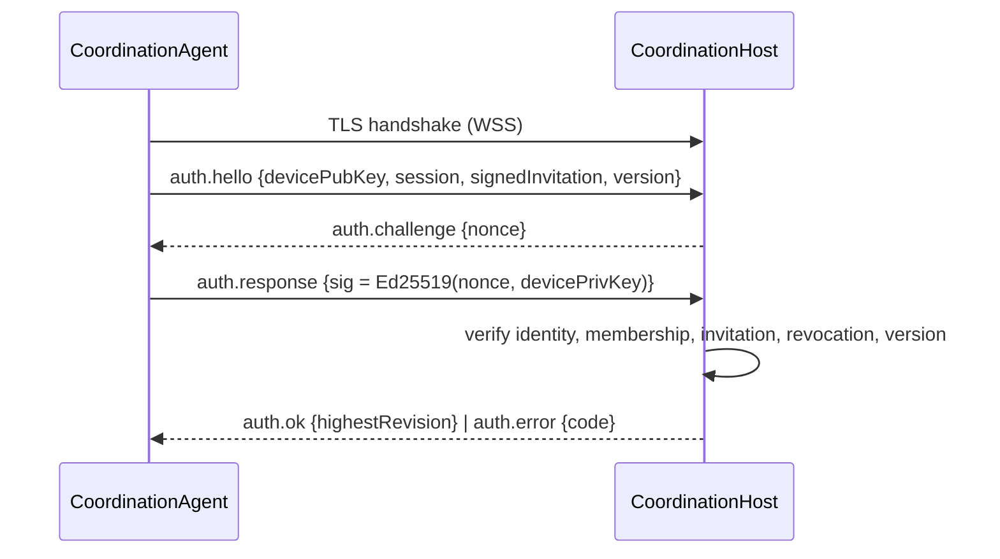

# Network & Message Protocol

> Living protocol doc for **Collaborative File Lock Sync (Host-Based MVP)**.
> Seeded from the design's "Network & Message Protocol Specification" section.
> The single source of truth for wire compatibility is `packages/protocol`
> (`MESSAGE_FORMAT_VERSION`). Related docs: [architecture.md](./architecture.md) ·
> [threat-model.md](./threat-model.md) · [testing.md](./testing.md)

All agent↔host traffic runs over **WSS (TLS)**. The message envelope is transport-agnostic,
so a future transport (e.g. QUIC) can reuse it unchanged.

## Connection & Handshake

1. Agent dials `Host_URL` over **WSS (TLS)**. The certificate is validated; on failure the
   connection is refused and the agent enters Offline_State.
2. Agent sends `auth.hello` with its `Device_Public_Key`, target `SessionId`,
   `Signed_Invitation`, and `MESSAGE_FORMAT_VERSION`.
3. Host replies `auth.challenge` with a random `nonce`.
4. Agent replies `auth.response` signing the nonce with its `Device_Private_Key`
   (Ed25519 challenge-response).
5. Host validates device identity, membership, invitation validity, revocation, and version.
   On success → `auth.ok` with the current `highestRevision`; else `auth.error` with an
   authorization/format code and the connection closes.



## Message Envelope (typed, versioned, signed)

Every application message after auth uses this envelope:

```jsonc
{
  "type": "lock.acquire", // message type from the catalog
  "version": 1, // MESSAGE_FORMAT_VERSION
  "eventId": "9f2c…-uuid", // globally unique per Signed_Event (idempotency)
  "session": {
    "repoId": "…",
    "teamId": "…",
    "branch": "…",
    "baseRevision": "…",
  },
  "deviceId": "dev-abc", // sender device (public-key id)
  "replay": { "counter": 10432, "nonce": "b64…" }, // monotonic per-device counter + nonce
  "sentAt": "2024-01-01T10:00:00Z", // advisory only; NEVER sole conflict resolver
  "payload": {/* type-specific */},
  "signature": "b64(Ed25519 over canonical(type,version,eventId,session,deviceId,replay,sentAt,payload))",
}
```

Host-emitted broadcasts and acks carry the assigned `eventRevision`.

## Message Catalog

| Category     | Client → Host                                                           | Host → Client                                      |
| ------------ | ----------------------------------------------------------------------- | -------------------------------------------------- |
| Auth         | `auth.hello`, `auth.response`                                           | `auth.challenge`, `auth.ok`, `auth.error`          |
| Presence     | `presence.report` (start/stop)                                          | `presence.update`                                  |
| Locks        | `lock.acquire`, `lock.release`, `lock.override`                         | `lock.update`, `lock.conflict`                     |
| Intents      | `intent.declare`, `intent.update`, `intent.withdraw`, `intent.progress` | `intent.update`, `intent.conflict`                 |
| Dependency   | `dep.snapshot`, `dep.delta`                                             | `dep.applied`                                      |
| Path change  | `path.renamed`, `path.deleted`, `file.created`                          | `path.update`                                      |
| Heartbeat    | `heartbeat.ping`                                                        | `heartbeat.ack`                                    |
| Sync         | `sync.request {fromRevision}`                                           | `sync.events {events[]}` / `sync.snapshot {state}` |
| Broadcast    | —                                                                       | `coordination.update`                              |
| Participants | —                                                                       | `participants.update`                              |
| Error        | —                                                                       | `error {code, message, refEventId?}`               |

## Idempotency & Replay Protection

- **Idempotency:** the host keeps an applied-`Event_ID` index per session. A duplicate
  `eventId` is applied at most once; the host returns the previously assigned `eventRevision`.
- **Replay protection:** each envelope carries a per-device **monotonic `counter`** plus a
  `nonce`. The host tracks the highest accepted counter per device; a counter ≤ last-seen (or
  a reused nonce) is rejected and state is unchanged.
- **Signature verification:** every envelope signature is verified against the sending
  device's non-revoked `Device_Public_Key` before any state change.
- **Schema/version validation:** malformed or unsupported-version messages are rejected with
  a `FORMAT_ERROR`; permission is checked before applying.

See [threat-model.md](./threat-model.md) for how these gates map to the STRIDE analysis.

## Monotonic Event_Revision Assignment

The host holds a per-session monotonic counter. On each accepted event it assigns
`revision = ++counter[session]`, guaranteeing uniqueness and strict ordering within a
session. On restart, the counter resumes above every persisted revision for that session.

**Conflict resolution:** the winner of any contested lock or Planned_File_Creation is the
claim with the **earliest assigned Event_Revision**. Losers are recorded as concurrent claims
and told the winning member + revision. Raw client timestamps are never the sole resolver.

## Reconnect-Safe Sync-From-Revision

1. Agent records the highest applied revision per session.
2. On reconnect it sends `sync.request {fromRevision}`.
3. Host returns `sync.events` for revisions `> fromRevision`; if it cannot serve
   incrementally it returns `sync.snapshot` and the agent replaces cached state.
4. Agent converges within 5s and **re-asserts** its still-held locks/intents, then clears
   staleness.

## Key Message Payloads

```jsonc
// lock.acquire payload
{ "scope": "src/api.ts", "scopeKind": "file|folder|glob", "mode": "soft|coordination-required|hard" }

// lock.conflict (host->client)
{ "scope": "src/api.ts", "winner": { "memberId": "u-1", "eventRevision": 400 }, "loserEventId": "…" }

// intent.declare payload
{ "modifyPaths": ["src/a.ts"], "createPaths": ["src/new.ts"], "description": "…" }

// dep.delta payload  (metadata only)
{ "changedEdges": [{ "from": "src/a.ts", "to": "src/b.ts", "kind": "runtime_import", "confidence": "high", "op": "add|remove" }],
  "changedManifests": ["package.json"], "changedLockfileHash": "sha256:…",
  "changedContracts": [{ "id": "openapi:orders", "fingerprint": "sha256:…" }] }

// coordination.update (host->client)
{ "entryType": "soft_lock|presence|intent|planned_file_creation|dependency_risk",
  "op": "added|removed", "path": "…",
  "member": { "memberId": "…", "deviceId": "…" }, "eventRevision": 421,
  "intent": { "intentId": "int-9", "description": "refactor auth" } // present for intent-derived entries
}

// participants.update (host->client)
// Connected includes authenticated live clients; offline includes admitted,
// non-revoked members without a live host connection.
{ "connected": ["alice", "bob"], "offline": ["carol"] }
```

## MCP Tool Surface

The Local_MCP_Server exposes exactly **13 tools** over stdio/local transport. Every response
wraps its data in the `McpEnvelope`, carrying `connection` and `staleness` on every response
(see [architecture.md](./architecture.md)).

| #   | Tool                                | Purpose                                                                                                                               |
| --- | ----------------------------------- | ------------------------------------------------------------------------------------------------------------------------------------- |
| 1   | `get_risk_map`                      | Per-path Risk_Map with contributors, explanation paths, planned file creations, highest revision. Own activity excluded.              |
| 2   | `get_team_status`                   | Active-work members with device IDs, declared task descriptions, repository-relative files, and activity roles; never source content. |
| 3   | `get_dependency_impact`             | Direct + reverse dependencies, shared contracts, risk level, explanation paths for given paths.                                       |
| 4   | `get_dependencies`                  | `{ path } → { dependsOn[], presentInGraph }`.                                                                                         |
| 5   | `get_dependents`                    | `{ path } → { dependedOnBy[], presentInGraph }`.                                                                                      |
| 6   | `declare_intent`                    | Declare modify/create paths + description; returns intentId, eventRevision, reclassifications.                                        |
| 7   | `update_intent`                     | Owner-only update of an intent's paths/description.                                                                                   |
| 8   | `withdraw_intent`                   | Owner-only withdrawal of an intent.                                                                                                   |
| 9   | `acquire_lock`                      | Acquire a soft/coordination-required/hard lock on a file/folder/glob scope.                                                           |
| 10  | `release_lock`                      | Release by lockId or scope; holder-only.                                                                                              |
| 11  | `subscribe_to_coordination_updates` | Stream `CoordinationUpdate`s for a session.                                                                                           |
| 12  | `get_connection_status`             | Online/offline + connected/offline participants (including idle teammates) + manual-coordination flag.                                |
| 13  | `get_project_session_status`        | Current session identity + authorization status.                                                                                      |

### Example tool schemas

```jsonc
// 1. get_risk_map — request
{ "session": { "repoId": "…", "teamId": "…", "branch": "…", "baseRevision": "…" } }
// get_risk_map — response.data
{
  "paths": [{
    "path": "src/api.ts",
    "riskLevel": "soft|coordination-required|hard",
    "contributors": [{ "memberId": "u-1", "kind": "soft_lock|presence|intent|hard_lock|coordination_required_lock|dependency" }],
    "explanation": { "type": "direct|indirect", "edges": [{ "from": "…", "to": "…", "kind": "runtime_import", "confidence": "high" }], "sharedContracts": ["openapi:orders"] },
    "acknowledgementRequired": false
  }],
  "plannedFileCreations": [{ "path": "src/new.ts", "memberId": "u-2" }],
  "highestRevision": 421
}
// errors: NOT_AUTHORIZED, SESSION_NOT_FOUND, OFFLINE (stale served)

// 2. get_team_status — request
{ "session": {…} }
// get_team_status — response.data
{
  "teamId": "my-team",
  "members": [{
    "memberId": "u-2",
    "deviceIds": ["dev-bob"],
    "files": [{ "path": "src/api.ts", "roles": ["editing", "soft-lock"] }],
    "tasks": [{ "intentId": "int-9", "description": "refactor auth", "modifyPaths": ["src/api.ts"], "createPaths": [] }],
    "lastEventRevision": 421
  }],
  "highestRevision": 421
}
// This is coordination metadata; source files, patches, and diffs are never returned.

// 6. declare_intent — request
{ "session": {…}, "modifyPaths": ["src/a.ts"], "createPaths": ["src/new.ts"], "description": "refactor auth" }
// declare_intent — response.data
{ "intentId": "int-9", "eventRevision": 422,
  "reclassified": [{ "path": "src/new.ts", "as": "modify", "reason": "path_exists" }] }
// errors: NOT_AUTHORIZED, FORMAT_ERROR (path>4096 or empty sets), OFFLINE_QUEUED

// 9. acquire_lock — request
{ "session": {…}, "scope": "src/api.ts", "scopeKind": "file|folder|glob" }
// acquire_lock — response.data (granted)
{ "lockId": "lk-3", "eventRevision": 425, "granted": true }
// acquire_lock — on contention
{ "granted": false, "concurrentClaim": true, "winner": { "memberId": "u-1", "eventRevision": 400 } }
// errors: FORMAT_ERROR (malformed glob), NOT_AUTHORIZED, OFFLINE_QUEUED
```

Offline-affecting tools never falsely report host acceptance: mutations are queued
(`OFFLINE_QUEUED`) or rejected, and query tools serve stale cached data flagged via the
`staleness` envelope.
